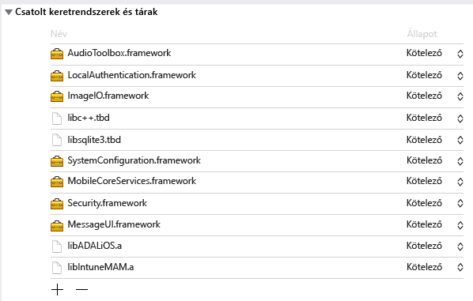
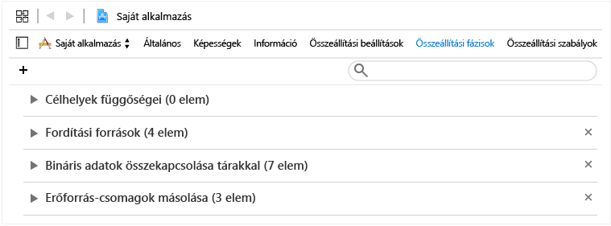
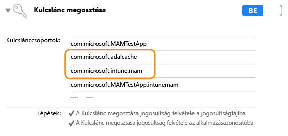

# <a name="microsoft-intune-app-sdk-for-ios-developer-guide"></a>A Microsoft Intune App SDK iOS rendszeren – fejlesztői útmutató

> [!NOTE]
> Először célszerű elolvasnia az [Intune App SDK használatának első lépései](intune-app-sdk-get-started.md) című cikket, amely útmutatást ad az integráció előkészítéséhez a támogatott platformokon.

Az iOS-hez készült Microsoft Intune App SDK lehetővé teszi, hogy Intune alkalmazásvédelmi szabályzatokat (vagy más néven MAM-szabályzatokat) építsen be iOS-alkalmazásába. A MAM-kompatibilis alkalmazás az, amelyik integrálva van az Intune App SDK-val. Mindez lehetővé teszi a rendszergazdáknak, hogy alkalmazásvédelmi szabályzatokat telepítsenek a mobilalkalmazásra vonatkozóan, ha az Intune aktívan felügyeli az alkalmazást.

## <a name="prerequisites"></a>Előfeltételek

* Szüksége lesz egy OS X 10.8.5 vagy újabb verziót futtató Mac OS-számítógépre, amelyen telepítve van az Xcode eszközkészlet 5-ös vagy újabb verziója.

* Olvassa el [az iOS-hez készült Intune App SDK licencfeltételeit](https://github.com/msintuneappsdk/ms-intune-app-sdk-ios/blob/master/Microsoft%20License%20Terms%20Intune%20App%20SDK%20for%20iOS%20.pdf). Nyomtassa ki és őrizze meg a licencfeltételeket. Az iOS-hez készült Intune App SDK letöltésével és használatával elfogadja licencfeltételeket.  Amennyiben a feltételeket nem fogadja el, ne használja a szoftvert.

* Töltse le az iOS-re készült Intune App SDK fájljait a [GitHubról](https://github.com/msintuneappsdk/ms-intune-app-sdk-ios).

## <a name="whats-in-the-sdk"></a>Az SDK tartalma

Az iOS-hoz készült Intune App SDK magában foglalja a statikus könyvtárat, az erőforrásfájlokat, az API-fejléceket, a hibakeresési beállításokat tartalmazó plist-fájlt és a konfiguráló eszközt. A mobilalkalmazások tartalmazhatják az erőforrásfájlokat, és általában statikus módon csatolhatók a könyvtárakhoz a szabályzatok érvénybe léptetéséhez. A speciális Intune MAM-funkciók használata API-k segítségével kényszeríthető ki.

Ez az útmutató az iOS-hez készült Intune App SDK következő összetevőit ismerteti:

* **libIntuneMAM.a**: az Intune App SDK statikus erőforrástára. Ha az alkalmazás nem használ bővítményeket, Önnek ezt az erőforrástárat kell csatolnia a projekthez, hogy az alkalmazás felügyelhető legyen az Intune mobilalkalmazás-kezeléssel.

* **IntuneMAM.framework**: Az Intune App SDK keretrendszere. Ezt a keretrendszert kell csatolnia a projekthez, hogy az alkalmazás felügyelhető legyen az Intune mobilalkalmazás-kezelés segítségével. Akkor használja ezt a keretrendszert a statikus erőforrástár helyett, ha az alkalmazás bővítményeket használ. Ez esetben a projekt nem hoz létre több példányt a statikus erőforrástárból.

* **IntuneMAMResources.bundle**: az SDK erőforrásait tartalmazó csomag.

* **Headers**: az Intune App SDK API-jainak elérhetővé tétele. Ha API-t használ, meg kell adnia az API-t tartalmazó fejlécfájlt. A következő fejlécfájlok azokat az API-függvényhívásokat tartalmazzák, amelyek az Intune App SDK funkcióinak működéséhez szükségesek:

    * IntuneMAMAsyncResult.h
    * IntuneMAMDataProtectionInfo.h
    * IntuneMAMDataProtectionManager.h
    * IntuneMAMFileProtectionInfo.h
    * IntuneMAMFileProtectionManager.h
    * IntuneMAMPolicyDelegate.h
    * IntuneMAMLogger.h


## <a name="how-the-intune-app-sdk-works"></a>Az Intune App SDK működése

Az iOS-hoz készült Intune App SDK révén minimális kódmódosítással adhat hozzá felügyeleti funkciókat az iOS-alkalmazásokhoz. Minél kevesebb kódmódosítás szükséges, annál gyorsabban dobhatja piacra a mobilalkalmazást – az egységesség és a stabilitás terén kötött kompromisszumok nélkül.


## <a name="build-the-sdk-into-your-mobile-app"></a>Az SDK beépítése a mobilalkalmazásba

Az Intune App SKD engedélyezéséhez kövesse az alábbi lépéseket:

1. **1. lehetőség**: Csatolás a `libIntuneMAM.a` erőforrástárhoz. Húzza a `libIntuneMAM.a` könyvtárat a projekthez használni kívánt elemek **Linked Frameworks and Libraries** (Csatolt keretrendszerek és könyvtárak) listájába.
    

    > [!NOTE]
    > Megjegyzés: ha azt tervezi, hogy közzéteszi az alkalmazást az App Store-ban, a `libIntuneMAM.a` végleges verzióját használja, ne a hibakeresési verziót. A végleges verziót a **release** (kiadás) mappában találja. A hibakeresési verzió részletes kimenetet ad, ami megkönnyíti az Intune App SDK problémáinak elhárítását.

    **2. lehetőség**: Az `IntuneMAM.framework` csatolása a projekthez. Húzza az `IntuneMAM.framework` könyvtárat a projekthez használni kívánt elemek **Linked Frameworks and Libraries** (Csatolt keretrendszerek és könyvtárak) listájába.

    > [!NOTE]
    > Ha a keretrendszert használja, manuálisan kell eltávolítania a szimulátorarchitektúrákat az univerzális keretrendszerből, mielőtt beküldi az alkalmazást az App Store-ba. Lásd „Az alkalmazás beküldése az App Store-ba” című szakaszt.

2. Vegye fel a következő iOS-keretrendszereket a projektbe:
    * MessageUI.framework
    * Security.framework
    * MobileCoreServices.framework
    * SystemConfiguration.framework
    * libsqlite3.dylib
    * libc++.dylib
    * ImageIO.framework
    * LocalAuthentication.framework
    * AudioToolbox.framework

    > [!NOTE]
    > Ha az alkalmazást iOS 7-re fejlesztették, állítsa a `LocalAuthentication.framework` `Status` (Állapot) attribútumát „Optional" (Választható) értékre. Ha a `Status` (Állapot) nincs beállítva, az alkalmazás nem indul el iOS 7-en.
    >
    > Emellett az Xcode 7 `.dylib` helyett már `.tbd` kiterjesztést használ.

3. Húzza az `IntuneMAMResources.bundle` erőforrás-csomagot a **Copy Bundle Resources** (Erőforrás-csomagok másolása) alatti **Build Phases** (Összeállítási fázisok) elemre a projektbe való felvételhez.


4. Írja be a `-force_load {PATH_TO_LIB}/libIntuneMAM.a` utasítást a következő helyek egyikére, kicserélve a `{PATH_TO_LIB}` sort az Intune App SDK elérési útjával:
    * a projekt `OTHER_LDFLAGS` buildkonfigurációs beállítása
    * a kezelőfelület **Other Linker Flags** (Más csatoló jelzők) területe<br>

    > [!NOTE]
    > A `PATH_TO_LIB` megkereséséhez jelölje ki a `libIntuneMAM.a` fájlt és, és válassza a **File** (Fájl) menü **Get Info** (Információ megjelenítése) parancsát. Másolja és illessze be a **Where** (Hely) feliratnál látható információt (az elérési utat) az **Info** (Információ) ablak **General** (Általános) szakaszából.

5. Ha a mobilalkalmazás fő Nib vagy a Storyboard fájlt definiál az info.plist fájlban, távolítsa el a **Main Storyboard** vagy a **Main Nib** fájlmezőket. Adja meg a korábban eltávolított Storyboard- vagy Nib-értékeket egy IntuneMAMSettings nevű új szótárban, a következő kulcsnevekkel:
    * MainStoryboardFile
    * MainStoryboardFile~ipad
    * MainNibFile
    * MainNibFile~ipad

    > [!NOTE]
    > Ha a mobilalkalmazás nem definiálja a fő Nib vagy Storyboard fájlt az Info.plist fájlban, ezek a beállítások nem szükségesek.

    Az info.plist fájlt nyers formátumban megtekintve láthatja a kulcsneveket. Kattintson jobb gombbal a dokumentum törzsében bárhol, és válassza a **Show Raw Keys/Values** (Nyers kulcsok/értékek megjelenítése) nézetet.

6. Engedélyezze a kulcsláncmegosztást (ha még nincs engedélyezve) a projekthez használni kívánt elemeken a **Capabilities** (Képességek) lehetőségre kattintva, majd kapcsolja be a **Keychain Sharing** (Kulcsláncmegosztás) kapcsolót. A következő lépéshez szükséges a kulcsláncmegosztás.

    > [!NOTE]
    > A telepítési profil esetében elengedhetetlen az új kulcsláncmegosztási értékek támogatása. A kulcslánc-hozzáférési csoportoknak támogatniuk kell a helyettesítő karaktert. Ezt a .mobileprovision fájl szövegszerkesztőben való megnyitásával ellenőrizheti, rákeresve a **keychain-access-groups** kifejezésre. Itt meggyőződhet arról, hogy használ-e helyettesítő karaktert. Példa:
    ```xml
    <key>keychain-access-groups</key>
    <array>
    <string>YOURBUNDLESEEDID.*</string>
    </array>
    ```

7. Miután engedélyezte a kulcsláncmegosztást, az alábbi lépésekkel hozhat létre egy különálló hozzáférési csoportot, amelyben az Intune App SDK adatait tárolhatja. A kulcslánc-hozzáférési csoportokat a kezelőfelületet vagy a jogosultságokat tartalmazó fájl használatával hozhatja létre.

    Ha a kezelőfelületet használja a kulcslánc-hozzáférési csoport létrehozására:

    a. Ha a mobilalkalmazás nem határozott meg kulcslánc-hozzáférési csoportokat, vegye fel az alkalmazás csomagazonosítóját az első csoport létrehozásához.

    b. Vegye fel a `com.microsoft.intune.mam` megosztott kulcslánc-csoportot. Ez a hozzáférési csoport az Intune App SDK-adatok tárolására szolgál.

    c. Vegye fel a `com.microsoft.adalcache` csoportot a meglévő hozzáférési csoportokba.

    

    Ha a jogosultságokat tartalmazó fájlt használja a kulcslánc-hozzáférési csoport létrehozására, az `$(AppIdentifierPrefix)` előtaggal együtt illessze be a kulcslánc-hozzáférési csoportot a jogosultságokat tartalmazó fájlba. Példa:  

    * `$(AppIdentifierPrefix)com.microsoft.intune.mam`
    * `$(AppIdentifierPrefix)com.microsoft.adalcache`

    > [!NOTE]
    > A jogosultságokat tartalmazó fájl egy XML-fájl, amely minden mobilalkalmazásnál egyedi, és speciális engedélyek és képességek meghatározására szolgál az iOS-alkalmazásban.

8. Ha az alkalmazás az Info.plist fájlban határozza meg az URL-sémákat, mindegyikhez vegyen fel új sémát az `-intunemam` utótaggal együtt.

9. Az iOS 9 és újabb rendszerre fejlesztett mobilalkalmazások esetében az alkalmazáshoz tartozó Info.plist fájl `LSApplicationQueriesSchemes` tömbjében tüntessen fel minden protokollt, amelyet az alkalmazás átad az `UIApplication canOpenURL` számára. Emellett minden egyes felsorolt protokollhoz vegyen fel egy új protokollt, és fűzze hozzá a `-intunemam` paramétert. A `http-intunemam`, `https-intunemam` és `ms-outlook-intunemam` elemet is fel kell venni a tömbbe.

10. Ha az alkalmazás jogosultságaiban meghatározott alkalmazáscsoportok találhatók, vegye fel ezeket a csoportokat az `AppGroupIdentifiers` szótárba, az IntuneMAMSettings kulcs karakterlánctömbjeként.

11. Csatolja a mobilalkalmazást az Azure Directory Authentication Library (ADAL) erőforrástárhoz (nem kötelező). Az Objective C-hez készült ADAL-könyvtár [elérhető a GitHubon](https://github.com/AzureAD/azure-activedirectory-library-for-objc).

    > [!NOTE]
    > Az Intune App SDK-t 2015. június 19-től az ADAL broker fiókkóddal tesztelték. Győződjön meg arról, hogy az ADAL-könyvtár legújabb/működő verziójához kapcsolódik-e.

12. Húzza az `ADALiOSBundle.bundle` erőforráscsomagot a **Copy Bundle Resources** (Erőforráscsomagok másolása) terület **Build Phases** (Összeállítási fázisok) elemére a projektbe való felvételhez.

13. Használja a `-force_load PATH_TO_ADAL_LIBRARY` összekötő lehetőséget a könyvtárhoz kapcsolódáshoz.

    Írja be a `-force_load {PATH_TO_LIB}/libADALiOS.a` utasítást a projekt `OTHER_LDFLAGS` buildkonfigurációs beállításába vagy az **Other Linker Flags** (Más csatoló jelzők) helyre a kezelőfelületen. A `PATH_TO_LIB` helyett adja meg az ADAL bináris fájljainak helyét.


## <a name="set-up-azure-directory-authentication-library"></a>Az Azure Directory Authentication Library (ADAL) beállítása

Az Intune App SDK az ADAL-t hitelesítésre és a feltételes indítási forgatókönyvek készítésére használja. Az ADAL-t használja ezenkívül arra, hogy regisztrálja a felhasználó identitását a MAM-szolgáltatásnál az eszközök regisztrációja nélkül történő felügyelet esetére.

Az ADAL használata során az alkalmazáshoz tartozó jogkivonatok biztonsága érdekében az alkalmazások használata legtöbbször az Azure Active Directoryban (Azure AD) való regisztrációhoz, valamint egyedi azonosító (más néven ClientID) és egyéb azonosítók lekéréséhez kötött. Az Intune App SDK az alapértelmezett regisztrációs értékeket használja, amikor kapcsolatba lép az Azure AD-val.  

Ha maga az alkalmazás ADAL-t használ hitelesítésre, abban az esetben a meglévő regisztrációs értékeket kell használnia, és felül kell bírálnia az Intune App SDK alapértékeit. Ez biztosítja azt, hogy a felhasználóknak ne kelljen kétszer hitelesíteniük magukat (egyszer az Intune App SDK felé, egyszer pedig az alkalmazás felé).

### <a name="adal-faqs"></a>ADAL – gyakori kérdések

**Melyik bináris ADAL-fájlokat használjam?**

Az Intune App SDK jelenleg a [GitHubon elérhető ADAL](https://github.com/AzureAD/azure-activedirectory-library-for-objc) broker ágát használja a feltételes hozzáférést igénylő alkalmazások támogatásához. (Tehát olyan alkalmazásokhoz, amelyek ebből következően függenek a Microsoft Authenticator alkalmazástól.) Az SDK ugyanakkor továbbra is kompatibilis az ADAL fő (master) ágával is. Az alkalmazásának megfelelő ágat használja.

**Hogyan lehet hivatkozni az ADAL bináris fájljaira?**

Írja be a `-force_load {PATH_TO_LIB}/libADALiOS.a` utasítást a projekt `OTHER_LDFLAGS` buildkonfigurációs beállításába vagy az **Other Linker Flags** (Más csatoló jelzők) helyre a kezelőfelületen. A `PATH_TO_LIB` helyett adja meg az ADAL bináris fájljainak helyét. Ne felejtse el ezenkívül másolni az ADAL csomagot az alkalmazásba.  

Részletesebb tájékoztatást az [GitHub ADAL rovatában](https://github.com/AzureAD/azure-activedirectory-library-for-objc) talál.

**Hogyan oszthatom meg az ADAL gyorsítótárát más, ugyanazzal a kiépítési profillal aláírt alkalmazásokkal?**

Ha az alkalmazás nem határozott meg kulcslánc-hozzáférési csoportokat, hozza létre az első csoportot az alkalmazás csomagazonosítójának felvételével.

Engedélyezze az ADAL egyszeri bejelentkezési funkcióját (SSO): ehhez vegye fel a `com.microsoft.adalcache` és a `com.microsoft.workplacejoin` hozzáférési csoportot a kulcslánc jogosultságai közé.

Ha explicit módon beállítja az ADAL megosztott gyorsítótárának kulcslánccsoportját, akkor feltétlenül a következő értékre állítsa: `<app_id_prefix>.com.microsoft.adalcache`. Az ADAL ezt állítja be, hacsak Ön felül nem bírálja. Ha egyéni kulcslánccsoportot szeretne megadni a `com.microsoft.adalcache` helyett az Info.plist fájl „IntuneMAMSettings” szakaszában, azt az `ADALCacheKeychainGroupOverride` kulccsal kell megadnia.

**Hogyan kényszeríthetem az Intune App SDK-t arra, hogy az alkalmazásom által már használt ADAL-beállításokat használja?**

Ha az alkalmazás már használja az ADAL-t, [Az Intune App SDK-beállítások konfigurálása](#configure-settings-for-the-intune-app-sdk) című témakörben talál tájékoztatást a következő beállítások értékének kitöltéséről:  

* ADALClientId
* ADALAuthority
* ADALRedirectUri
* ADALRedirectScheme
* ADALCacheKeychainGroupOverride


**Hogyan bírálhatom felül az Azure AD-szolgáltató URL-címét egy bérlőspecifikus, futtatás közben megadott URL-címmel?**

Állítsa be az `aadAuthorityUriOverride` tulajdonságot az IntuneMAMPolicyManager példányon.

> [!NOTE]
> Ezt akkor kell megtennie, ha az eszközök regisztrálása nélkül használja a MAM szolgáltatást. Így az SDK újra felhasználhatja az alkalmazás által beolvasott ADAL frissítési jogkivonatot.

Az SDK továbbra is ezt a szolgáltatói URL-címet használja a szabályzatok frissítésére és a későbbi regisztrációs kérelmekhez, hacsak nem törlik vagy módosítják az értéket.  Ezért fontos törölni az értéket, ha egy vállalati felhasználó kijelentkezik az alkalmazásból, és újra beállítani, ha egy új vállalati felhasználó jelentkezik be.

**Mi a teendőm, ha maga az alkalmazás már az ADAL-t használja hitelesítésre?**

Ha az alkalmazás maga az ADAL-t használja hitelesítésre, a következő műveleteket kell elvégeznie:

1. Adja meg az ADAL-hívásokhoz használandó ClientID-t a projekt Info.plist fájljában, az IntuneMAMSettings szótár alatt található `ADALClientId` nevű kulcsban.

2. A szintén az IntuneMAMSettings szótár alatt található `ADALAuthority` nevű kulcsban adja meg az Azure AD-szolgáltatót.

3. A szintén az IntuneMAMSettings szótár alatt található `ADALRedirectUri` nevű kulcsban adja meg az ADAL-hívásokhoz használandó átirányítási URI-t. Az alkalmazás átirányítási URI-formátumától függően előfordulhat, hogy az `ADALRedirectScheme` beállításait is meg kell adnia.

**Mi a teendő, ha az alkalmazás még nem ADAL-t használ a hitelesítéshez?**

Ha az alkalmazás nem ADAL-t használ, az Intune App SDK alapértelmezett értékeket fog megadni az ADAL-paraméterekhez, és az Azure AD-vel fogja kezelni a hitelesítést.

## <a name="register-your-app-with-the-intune-mam-service"></a>Az alkalmazás regisztrálása az Intune MAM-szolgáltatásában

### <a name="use-the-apis"></a>Az API-k használata
Az Intune App SDK mostantól lehetőséget nyújt arra, hogy az iOS-alkalmazások anélkül fogadják az Intune-tól az alkalmazásvédelmi szabályzatokat, hogy az Intune-ban regisztrálva kellene lenniük a mobileszköz-felügyeletre (MDM). Az SDK az új funkciót olyan új API-k segítségével biztosítja, amelyek lehetővé teszik az alkalmazás számára az alkalmazásvédelmi szabályzatok fogadását. Az új API-k használatához kövesse az alábbi lépéseket:

1. Használja az Intune App SDK legújabb kiadását, amely az eszközregisztrációval és nélküle is lehetőséget nyújt az alkalmazások felügyeletére. .

2. Vegye fel a IntuneMAMEnrollment.h-t minden olyan fájlba, amely hívni fogja az API-kat.

### <a name="register-accounts"></a>Fiókok regisztrálása

Egy alkalmazás akkor fogadhat alkalmazásvédelmi szabályzatot az Intune szolgáltatástól, ha az alkalmazás regisztrálva van egy megadott felhasználói fiók nevében. Az alkalmazás felelős azért, hogy regisztráljon minden újonnan bejelentkezett felhasználót az Intune App SDK-val. Az új felhasználói fiók hitelesítését követően az alkalmazásnak meg kell hívnia a `registerAndEnrollAccount` metódust, amelyet a „Headers/IntuneMAMEnrollment.h” fájl tartalmaz:

```objc
/**


 *  This method will add the account to the list of registered accounts.
 *  An enrollment request will immediately be started.
 *  @param identity The UPN of the account to be registered with the SDK
 */

(void)registerAndEnrollAccount:(NSString *)identity;

```
Az SDK a `registerAndEnrollAccount` metódus meghívásával regisztrálja a felhasználói fiókot, és megpróbálja regisztrálni az alkalmazást ennek a fióknak a nevében. Ha a regisztráció bármilyen okból nem sikerül, az SDK 24 óra múlva újra próbálkozik. Hibakeresési célokra az alkalmazás egy delegálton keresztül fogadhat értesítéseket a regisztrációs kérések eredményéről.

Az API meghívása után az alkalmazás a szokásos módon működhet tovább. Ha a regisztráció sikeres, az SDK értesíti a felhasználót, hogy újra kell indítani az alkalmazást. Ekkor a felhasználó azonnal újraindíthatja az alkalmazást.

### <a name="deregister-accounts"></a>Fiókok regisztrációjának megszüntetése

Mielőtt egy felhasználó kijelentkezik az alkalmazásból, az alkalmazásnak meg kell szüntetnie a felhasználó regisztrációját az SDK-ban. Ez a következőket garantálja:

1. Nem lesznek további próbálkozások a felhasználói fiók regisztrálására.

2. Ha a felhasználó sikeresen regisztrálta az alkalmazást, a felhasználó és az alkalmazás regisztrációja megszűnik az Intune MAM-szolgáltatásban, és a rendszer törli az alkalmazásvédelmi szabályzatot.

3. Ha az alkalmazás szelektív törlést kezdeményez (igény szerint), akkor a munkahellyel vagy az iskolával kapcsolatos összes adat törlődik.

A felhasználó kijelentkeztetése előtt az alkalmazásnak meg kell hívnia a következő, a „Headers/IntuneMAMEnrollment.h” fájlban található API-t:

```objc
/*
 *  This method will remove the provided account from the list of
 *  registered accounts.  Once removed, if the account has enrolled
 *  the application, the account will be un-enrolled.
 *  @note In the case where an un-enroll is required, this method will block
 *  until the Intune MAM AAD token is acquired, then return.  This method must be called before  
 *  the user is removed from the application (so that required AAD tokens are not purged
 *  before this method is called).
 *  @param identity The UPN of the account to be removed.
 *  @param doWipe   If YES, a selective wipe if the account is un-enrolled
 */

(void)deRegisterAndUnenrollAccount:(NSString *)identity withWipe:(BOOL)doWipe;
```

Ezt a metódust még a felhasználó Azure AD-jogkivonatainak törlése előtt kell meghívni. Az SDK-nak azért van szüksége a felhasználó alkalmazás-jogkivonatára, hogy a felhasználó nevében küldhessen el bizonyos kéréseket az Intune MAM-szolgáltatásnak.

Ha az alkalmazás saját maga végzi a felhasználó munkahelyi vagy iskolai adatainak törlését, akkor a `doWipe` jelző „false” (hamis) értékre állítható. Ellenkező esetben az alkalmazás az SDK-t utasíthatja a szelektív törlés indítására. Ennek eredményeképpen létrejön egy hívás az alkalmazás szelektív törlési delegáltja felé.

```objc
[[IntuneMAMEnrollmentManager instance] deRegisterAndUnenrollAccount:@”user@foo.com” withWipe:YES];
```

### <a name="enroll-without-prior-sign-in"></a>Regisztráció előzetes bejelentkezés nélkül

Olyan alkalmazás is fogadhat alkalmazásvédelmi szabályzatot az Intune szolgáltatástól, amely nem jelentkezteti be a felhasználót az Azure Active Directoryval. Ez esetben az API meghívásával kell utasítani az SDK-t ennek a hitelesítésnek a kezelésére. Az alkalmazásoknak ezt a módszert kell használniuk abban az esetben, ha nem hitelesítették a felhasználót az Azure AD-vel, ugyanakkor szükség van az alkalmazásvédelmi szabályzat lekérésére az adatok védelméhez. Ilyen például, ha másik hitelesítési szolgáltatást használ az alkalmazásba való bejelentkezésre, vagy ha az alkalmazás egyáltalán nem támogatja a bejelentkezést. Ehhez az alkalmazásnak meg kell hívnia a `loginAndEnrollAccount` metódust, amelyet a „Headers/IntuneMAMEnrollment.h” fájl tartalmaz:

```objc
/**
 *  Creates an enrollment request which is started immediately.
 *  If no token can be retrieved for the identity, the user will be prompted
 *  to enter their credentials, after which enrollment will be retried.
 *  @param identity The UPN of the account to be logged in and enrolled.
 */
 (void)loginAndEnrollAccount: (NSString *)identity;

```

A metódus meghívása esetén az SDK hitelesítő adatok megadását kéri a felhasználótól, ha nem található meglévő token///jogkivonat. Az SDK eztuán megpróbálja regisztrálni az alkalmazást a fiók nevében. A metódus nil (nulla) identitással is meghívható. Ez esetben az SDK regisztrálja az eszköz meglévő MAM-felhasználóját, vagy ha nem talál meglévő felhasználót, kéri a felhasználótól a felhasználónevet.

Ha a regisztráció sikertelen, az alkalmazásnak valamikor a jövőben újra meg kell vizsgálnia az API meghívásának lehetőségét, függően a sikertelenség részleteitől. Az alkalmazás egy delegálton keresztül fogadhat értesítéseket a regisztrációs kérések eredményéről.

Az API meghívása után az alkalmazás a szokásos módon működhet tovább. Ha a regisztráció sikeres, az SDK értesíti a felhasználót, hogy újra kell indítani az alkalmazást.

## <a name="status-result-and-debug-notifications"></a>Állapot-, eredmény- és hibakeresési értesítések

Az alkalmazás az Intune MAM-szolgáltatásokhoz intézett kérések közül a következők esetében tudja fogadni az állapot-, eredmény- és hibakeresési értesítéseket:

 - Regisztrációs kérések
 - Szabályzatfrissítési kérések
 - Regisztrációtörlési kérések

Az értesítéseket delegáltmetódusok adják át. Ezeket a „Headers/IntuneMAMEnrollmentDelegate.h” fájl tartalmazza:

```objc
/**
 *  Called when an enrollment request operation is completed.
 * @param status status object containing debug information
 */

(void)enrollmentRequestWithStatus:(IntuneMAMEnrollmentStatus *)status;

/**
 *  Called when a MAM policy request operation is completed.
 *  @param status status object containing debug information
 */
(void)policyRequestWithStatus:(IntuneMAMEnrollmentStatus *)status;

/**
 *  Called when a un-enroll request operation is completed.
 *  @Note: when a user is un-enrolled, the user is also de-registered with the SDK
 *  @param status status object containing debug information
 */

(void)unenrollRequestWithStatus:(IntuneMAMEnrollmentStatus *)status;

```

Ezek a delegáltmetódusok egy `IntuneMAMEnrollmentStatus` objektumot adnak vissza, amely a következő információkat tartalmazza:

- A kéréshez társított fiók identitását
- A kérés eredményét jelölő állapotkódot
- Az állapotkód leírását tartalmazó hibaüzenet-karakterláncot
- Egy `NSError` objektumot

Ezt az objektumot az IntuneMAMEnrollmentStatus.h nevű fájl definiálja a visszaadható konkrét állapotkódokkal együtt.


### <a name="sample-code"></a>Mintakód

A következők a delegáltmetódusok megvalósítására szolgálnak példákkal:

```objc
- (void)enrollmentRequestWithStatus:(IntuneMAMEnrollmentStatus *)status
{
    NSLog(@"enrollment result for identity %@ with status code %ld", status.identity, (unsigned long)status.statusCode);
    NSLog(@"Debug Message: %@", status.errorString);
}


- (void)policyRequestWithStatus:(IntuneMAMEnrollmentStatus *)status
{
    NSLog(@"policy check-in result for identity %@ with status code %ld", status.identity, (unsigned long)status.statusCode);
    NSLog(@"Debug Message: %@", status.errorString);
}

- (void)unenrollRequestWithStatus:(IntuneMAMEnrollmentStatus *)status
{
    NSLog(@"un-enroll result for identity %@ with status code %ld", status.identity, (unsigned long)status.statusCode);
    NSLog(@"Debug Message: %@", status.errorString);
}

```

## <a name="app-restart"></a>Az alkalmazás újraindítása

Amikor egy alkalmazás először kap alkalmazásvédelmi szabályzatokat, újra kell indulnia a szükséges beavatkozási pontok alkalmazásához. Az SDK biztosít egy delegáltmetódust a „Headers/IntuneMAMPolicyDelegate.h” fájlban, amellyel értesíteni lehet az alkalmazást az újraindítás szükségességéről.

```objc
 - (BOOL) restartApplication
```
A metódus visszatérési értéke közli az SDK-val, hogy az alkalmazás fogja-e kezelni a szükséges újraindítást:   

 - Ha a visszatérési érték true (igaz), akkor az alkalmazás fogja kezelni az újraindítást.   

 - Ha a visszatérési érték false, akkor az SDK fogja újraindítani az alkalmazást a metódus visszatérése után. Az SDK azonnal megjelenít egy párbeszédpanelt, amely arra kéri a felhasználót, hogy indítsa újra az alkalmazást.

## <a name="customize-your-apps-behavior"></a>Az alkalmazás viselkedésének testreszabása

Az Intune App SDK több olyan API-val rendelkezik, amelyeket meg lehet hívni az alkalmazáshoz telepített Intune-beli alkalmazásvédelmi szabályzat információinak beolvasásához. Ezekkel az adatokkal testre lehet szabni az alkalmazás viselkedését. A legtöbb alkalmazásvédelmi szabályzatbeállítás automatikus kényszerítését az alkalmazás helyett az SDK végzi. Az alkalmazás által implementálandó egyetlen beállítás a Mentés másként vezérlő.

### <a name="get-the-app-protection-policy-settings"></a>Az alkalmazásvédelmi szabályzatbeállítások beolvasása

#### <a name="intunemampolicymanagerh"></a>IntuneMAMPolicyManager.h
Az IntuneMAMPolicyManager osztály tartalmazza az alkalmazáshoz telepített Intune alkalmazásvédelmi szabályzatot. Olyan API-kat tesz közzé, amelyek hasznosak lehetnek [több identitás engedélyezésekor](#-enable-multi-identity-optional).

#### <a name="intunemampolicyh"></a>IntuneMAMPolicy.h
Az IntuneMAMPolicy osztály tartalmazza az alkalmazáshoz telepített Intune alkalmazásvédelmi szabályzatot. Az osztályban található legtöbb szabályzatbeállítás kényszerítését az SDK végzi, de bármikor testre szabhatja az alkalmazás viselkedését a szabályzatbeállítások kényszerítése alapján.

Ez az osztály tartalmazza azokat az API-kat, amelyek a Mentés másként vezérlők implementálásához szükségesek. Ennek részleteit a következő szakaszban találja.

### <a name="implement-save-as-controls"></a>A Mentés másként vezérlőinek implementálása

Az Intune lehetővé teszi a rendszergazdák számára a felügyelt alkalmazások adatmentéshez használható tárolási helyeinek meghatározását. Az alkalmazások lekérhetik az engedélyezett tárolási helyek listáját az Intune App SDK-tól az **isSaveToAllowedForLocation** API használatával, ahogyan az az **IntuneMAMPolicy.h** nevű fájlban szerepel.

Mielőtt az alkalmazás felügyelt adatokat menthetne felhőbeli tárhelyre vagy helyi adattárolókba, az **isSaveToAllowedForLocation** API használatával ellenőriznie kell, hogy a rendszergazda engedélyezte-e az adatmentést az adott helyre.

Az alkalmazásoknak az **isSaveToAllowedForLocation** használatakor át kell adniuk a tárolási hely UPN-jét, amennyiben az elérhető.

#### <a name="supported-save-locations"></a>Támogatott mentési helyek

Az **isSaveToAllowedForLocation** API által biztosított állandókkal lehet ellenőrizni, hogy a rendszergazda engedélyezi-e az adatok mentését az IntuneMAMPolicy.h nevű fájlban meghatározott alábbi helyekre:

* IntuneMAMSaveLocationOther
* IntuneMAMSaveLocationOneDriveForBusiness
* IntuneMAMSaveLocationSharePoint
* IntuneMAMSaveLocationBox
* IntuneMAMSaveLocationDropbox
* IntuneMAMSaveLocationGoogleDrive
* IntuneMAMSaveLocationLocalDrive

Az alkalmazásoknak az **isSaveToAllowedForLocation** API állandóival kell ellenőrizniük, hogy az adatok menthetők-e a „felügyeltnek” tekintett, például a OneDrive Vállalati verziójába, vagy „személyes” helyekre. Emellett akkor is szükséges az API használata, ha az alkalmazás nem képes megállapítani egy adott helyről, hogy az „felügyelt” vagy „személyes”.

A „személyes” helyeket az `IntuneMAMSaveLocationOther` állandó képviseli.

Az `IntuneMAMSaveLocationLocalDrive` állandót akkor érdemes használni, amikor az alkalmazás a helyi eszközre ment adatot.

## <a name="configure-settings-for-the-intune-app-sdk"></a>Az Intune App SDK-beállítások konfigurálása

Az Intune App SDK beállítását és konfigurálását az alkalmazás Info.plist fájljában található **IntuneMAMSettings** szótárral végezheti el. A következő táblázatban az összes támogatott beállítás látható.

Egy részükről már volt szó korábbi szakaszokban, más részük pedig nem vonatkozik minden alkalmazásra.

Beállítás  | Típus  | Meghatározás | Kötelező?
--       |  --   |   --       |  --
ADALClientId  | Karakterlánc  | Az alkalmazás Azure AD ügyfél-azonosítója. | Kötelező, ha az alkalmazás használja az ADAL-t. |
ADALAuthority | Karakterlánc | Az alkalmazás használatban lévő Azure AD-szolgáltatója. Használja azt a saját környezetet, ahol az AAD-fiókok konfigurálása megtörtént. | Kötelező, ha az alkalmazás használja az ADAL-t. Ha ez az érték hiányzik, a rendszer egy Intune-beli alapértelmezett értéket használ.|
ADALRedirectUri  | Karakterlánc  | Az alkalmazás Azure AD átirányítási URI-ja. | Az ADALRedirectUri vagy az ADALRedirectScheme kötelező, ha az alkalmazás használja az ADAL-t.  |
ADALRedirectScheme  | Karakterlánc  | Az alkalmazás Azure AD átirányítási sémája. Használható az ADALRedirectUri helyett, ha az alkalmazás átirányítási URI-ja `scheme://bundle_id` formátumú. | Az ADALRedirectUri vagy az ADALRedirectScheme kötelező, ha az alkalmazás használja az ADAL-t. |
ADALLogOverrideDisabled | Logikai  | Megadásával az SDK átirányítja az összes ADAL-naplófájlt (beleértve az esetleges ADAL-hívásokat az alkalmazásból) a saját naplófájljába. Az alapértelmezett érték a Nem. Állítsa be a YES értéket, ha az alkalmazás visszahívja a saját ADAL-naplóját. | Nem kötelező. |
ADALCacheKeychainGroupOverride | Karakterlánc  | Az ADAL-gyorsítótárhoz a „com.microsoft.adalcache” helyett használandó kulcslánccsoportot adja meg. Vegye figyelembe, hogy ez nem tartalmazza az app-id előtagot. Ezt az előtagot futás közben fogja megkapni a karakterlánc. | Nem kötelező. |
AppGroupIdentifiers | A karakterlánc tömbje  | Az alkalmazáscsoportok tömbje az alkalmazás jogosultságainak com.apple.security.application-groups szakaszában. | Szükséges, ha az alkalmazás alkalmazáscsoportokat használ. |
ContainingAppBundleId | Karakterlánc | Megadja a bővítményt tartalmazó alkalmazás csomagazonosítóját. | IOS-bővítményekhez szükséges. |
DebugSettingsEnabled| Logikai | Ha YES értékű, használhatók a Settings csomagban található tesztszabályzatok. Az alkalmazásokat *tilos* úgy szállítani, hogy engedélyezve van bennük ez a beállítás. | Nem kötelező. |
MainNibFile<br>MainNibFile~ipad  | Karakterlánc  | Ennek a beállításnak tartalmaznia kell az alkalmazás fő Nib-fájljának nevét.  | Kötelező, ha az alkalmazás a MainNibFile-t az Info.plist fájlban definiálja. |
MainStoryboardFile<br>MainStoryboardFile~ipad  | Karakterlánc  | Ennek a beállításnak tartalmaznia kell az alkalmazás fő storyboard-fájljának nevét. | Kötelező, ha az alkalmazás a UIMainStoryboardFile-t az Info.plist fájlban definiálja. |
MAMPolicyRequired| Logikai| Azt adja meg, hogy megakadályozza-e a rendszer az alkalmazás elindítását, ha az alkalmazásnak nincs Intune alkalmazásvédelmi szabályzata. Az alapértelmezett érték a Nem. <br><br> Megjegyzés: nem lehet olyan alkalmazásokat benyújtani az App Store-ba, amelyeknél a MAMPolicyRequired beállítása IGEN értékű. | Nem kötelező. |
MAMPolicyWarnAbsent | Logikai| Azt adja meg, hogy figyelmeztesse-e az alkalmazás a felhasználót az indítás közben, ha az alkalmazásnak nincs Intune alkalmazásvédelmi szabályzata. Megjegyzés: nem lehet olyan alkalmazásokat benyújtani az áruházba, amelyeknek YES értékű ez a beállítása. | Nem kötelező. |
MultiIdentity | Logikai| Azt adja meg, hogy az alkalmazás képes-e kezelni a többszörös identitást. | Nem kötelező. |
SplashIconFile <br>SplashIconFile ~ ipad | Karakterlánc  | Az Intune-kezdőképet (indítóképernyőt) tartalmazó ikonfájlt határozza meg. | Nem kötelező. |
SplashDuration | Szám | Az Intune-kezdőképernyő megjelenésének minimális időtartama (másodpercben) az alkalmazás indításakor. Az alapértelmezett érték 1.5. | Nem kötelező. |
BackgroundColor| Karakterlánc| A kezdő- és a PIN-kód bevitelére szolgáló képernyő háttérszínét adja meg. Hexadecimális RGB-karakterláncot fogad el „#XXXXXX” alakban, amelyben az X-ek helyén számjegy (0–9), illetve és A és F közötti nagybetű állhat. A kettőskereszt jel kihagyható.   | Nem kötelező. Alapértelmezése a világosszürke szín. |
ForegroundColor| Karakterlánc| A kezdőképernyő és a PIN-kód bevitelére szolgáló képernyő előtérszínét, például a szöveg színét határozza meg. Hexadecimális RGB-karakterláncot fogad el „#XXXXXX” alakban, amelyben az X-ek helyén számjegy (0–9), illetve és A és F közötti nagybetű állhat. A kettőskereszt jel kihagyható.  | Nem kötelező. Alapértelmezett értéke a fekete. |
AccentColor | Karakterlánc| A PIN-kód megadására szolgáló képernyő kiemelőszínét (például a gombszöveg színét és a mezők kijelölésének színét) határozza meg. Hexadecimális RGB-karakterláncot fogad el „#XXXXXX” alakban, amelyben az X-ek helyén számjegy (0–9), illetve és A és F közötti nagybetű állhat. A kettőskereszt jel kihagyható.| Nem kötelező. Alapértéke a rendszer kék színe. |
MAMTelemetryDisabled| Logikai| Az határozható meg vele, hogy az SDK ne küldjön telemetriai adatokat a háttérrendszerének.| Nem kötelező. |

> [!NOTE]
> Ha az alkalmazás elérhető lesz az App Store-ban, a `MAMPolicyRequired` értékét NEM értékre kell beállítani az App Store irányelvei alapján.

## <a name="telemetry"></a>Telemetria

Az iOS-hez készült Intune App SDK alapértelmezés szerint a következő használati eseményekkel kapcsolatos telemetriai adatokat naplózza. Az adatokat az SDK a Microsoft Intune-nak küldi el.

* **Az alkalmazások indítása:** a Microsoft Intune tájékozódhat a különböző felügyeleti típusú MAM-kompatibilis alkalmazások használatáról (MAM az MDM-mel, MAM MDM-regisztráció nélkül stb.).

* **Regisztrációs hívások**: a Microsoft Intune a sikerességi arányról és az ügyféloldalról kezdeményezett regisztrációs hívások egyéb teljesítménymutatóiról is gyűjt információkat.

> [!NOTE]
> Ha nem kíván az Intune App SDK-ból származó telemetriai adatokat küldeni a Microsoft Intune-nak a mobilalkalmazásból, le kell tiltania az Intune App SDK-ban a telemetriai adatok rögzítését. Ehhez állítsa a `MAMTelemetryDisabled` tulajdonságot YES értékre az IntuneMAMSettings szótárban.

## <a name="enable-multi-identity-optional"></a>A többszörös identitás engedélyezése (nem kötelező)

Az SDK alapértelmezés szerint az alkalmazás egészére alkalmazza a szabályzatot. A MAM többszörös identitás szolgáltatásával engedélyezhető a szabályzatok identitásszintű alkalmazása. Ebből az alkalmazásnak nagyobb részt kell vállalnia, mint a MAM többi funkciójából.

Az alkalmazásnak tájékoztatnia kell az App SDK-t, ha módosítani kívánja az aktív identitást. Az SDK szintén értesíti az alkalmazást, ha identitásváltás szükséges. Jelenleg csak egy felügyelt identitás támogatott. Ha a felhasználó már regisztrálta az eszközt vagy az alkalmazást, az SDK ezt az identitást használja, és ezt tekinti az elsődleges felügyelt identitásnak. Az alkalmazás többi felhasználójával nem felügyeltként bánik, szabályzatbeállításaik korlátlanok.

Felhívjuk, hogy az identitás egyszerűen egy karakterláncként van definiálva. Az identitás karakterláncában a kis- és nagybetűk nincsenek megkülönböztetve. Az SDK nem feltétlenül olyan kis- és nagybetűkkel adja vissza a tőle kért identitásokat, mint ahogyan az az identitás beállításakor eredetileg meg volt adva.

### <a name="identity-overview"></a>Az identitás áttekintése

Az identitás egyszerűen egy fiók felhasználóneve (például user@contoso.com). A fejlesztők a következő szinteken állíthatják be az alkalmazás identitását:

* **Folyamat identitása**: a folyamat szintjén állítja be az identitást, és elsősorban egyidentitású alkalmazások esetében használatos. Ez az identitás hatással van minden műveletre, fájlra és a kezelőfelületre is.

* **Kezelőfelület identitása**: azt határozza meg, hogy milyen szabályzatok alkalmazandók a főszálban végzett kezelőfelületi műveletekre, például a kivágásra, a másolásra, a beillesztésre, a PIN-kód megadására, a hitelesítésre vagy az adatmegosztásra. A kezelőfelület identitása nincs hatással a fájlműveletekre, például a titkosításra vagy a biztonsági mentésre.

* **Szál identitása**: azt határozza meg, hogy milyen szabályzatok alkalmazandók az aktuális szálra. Ez az identitás hatással van minden műveletre, fájlra és a kezelőfelületre is.

Az identitás helyes beállítása az alkalmazás feladata, függetlenül attól, hogy felügyelt felhasználóról van-e szó vagy sem.

Minden szálnak minden pillanatban van egy effektív identitása mind a kezelőfelületi műveletekre, mind a fájlműveletekre vonatkozóan. A rendszer ennek az identitásnak az alapján határozza meg, hogy kell-e alkalmazni szabályzatokat, és ha igen, milyeneket. Ha az identitás „no identity”, vagy ha nem felügyelt felhasználóról van szó, a rendszer nem alkalmaz szabályzatokat. Az alábbi ábrán látható, hogy a rendszer miként határozza meg a tényleges identitásokat.

  

### <a name="thread-queues"></a>Szálak várólistái

Az alkalmazások gyakran indítanak aszinkron és szinkron feladatokat a szálak várólistáinak. Az SDK elfogja a Grand Central Dispatch (GCD) típusú hívásokat, és az aktuális szál identitását társítja az indított hívásokhoz. A feladatok befejezésekor az SDK átmenetileg módosítja a szál identitását a feladathoz társított identitásra, befejezi a feladatokat, majd visszaállítja a szál eredeti identitását.


Tekintettel arra, hogy az `NSOperationQueue` a GCD-re épül, az `NSOperations` műveletek azzal az identitással futnak, amely a szál identitása volt az adott művelet `NSOperationQueue` várólistába való felvételekor. Az `NSOperations` műveletek és a GCD segítségével közvetlenül indított függvények módosíthatják is a szál aktuális identitását, amikor futnak. Ez az identitás felülbírálja az indító száltól örökölt identitást.

### <a name="file-owner"></a>A fájl tulajdonosa

Az SDK nyilvántartja a helyi fájltulajdonosok identitását, és annak megfelelően alkalmazza a szabályzatokat. A rendszer a fájlhoz a létrehozásakor vagy csonkolási módban való megnyitásakor rendeli hozzá a tulajdonost. A rendszer tulajdonosként a műveletet végrehajtó szál effektív fájlműveleti identitását állítja be.

Az alkalmazások explicit módon is megadhatják a fájl tulajdonosát az `IntuneMAMFilePolicyManager` segítségével. Az alkalmazások az `IntuneMAMFilePolicyManager` segítségével kérhetik le a fájl tulajdonosát, és állíthatják be a kezelőfelület identitását a fájl tartalmának megjelenítése előtt.

### <a name="shared-data"></a>Megosztott adatok

Ha az alkalmazás olyan fájlokat hoz létre, amelyek felügyelt és nem felügyelt felhasználóktól származó adatokat is tartalmaznak, akkor az alkalmazás felelős a felügyelt felhasználó adatainak titkosításáért. Az adatokat a `protect` és az `unprotect` API-k segítségével titkosíthatja az `IntuneMAMDataProtectionManager` eszközben.

A `protect` metódus identitást fogad el paraméterként. Ez lehet felügyelt és nem felügyelt felhasználó is. Felügyelt felhasználó esetén titkosítja az adatokat. Nem felügyelt felhasználó esetén az identitást kódoló fejlécet ad hozzá az adatokhoz, de nem titkosítja az adatokat. A `protectionInfo` metódussal lehet bekérni az adat tulajdonosát.

### <a name="share-extensions"></a>Megosztási bővítmények

Ha az alkalmazás megosztási bővítményt tartalmaz, a megosztás alatt álló elem tulajdonosa az `IntuneMAMDataProtectionManager` `protectionInfoForItemProvider` metódusával kérhető le. Ha a megosztott elem fájl, az SDK kezeli a fájl tulajdonosának beállítását. Ha a megosztott elem adat, és az adatok fájlban lesznek tárolva, akkor az alkalmazás felelős a fájl tulajdonosának beállításáért és a `setUIPolicyIdentity` API meghívásáért, mielőtt megjelenítené az adatokat a kezelőfelületen.

### <a name="turning-on-multi-identity"></a>A többszörös identitás bekapcsolása

Alapértelmezés szerint az alkalmazások egyszeres identitásnak minősülnek. Az SDK a folyamat identitását a regisztrált felhasználóhoz állítja be. A többszörös identitás támogatás engedélyezéséhez a `MultiIdentity` nevű és YES értékű beállítást kell felvenni az alkalmazás Info.plist fájljába, az IntuneMAMSettings szótárba.

> [!NOTE]
> Ha engedélyezve van a többszörös identitás, a folyamat identitása, a kezelőfelület identitása és a szálak identitása nil lesz. Ezek megfelelő beállítása az alkalmazás feladata.

### <a name="switching-identities"></a>Identitásváltás

* **Az alkalmazás által kezdeményezett identitásváltás**:

    A többszörös identitású alkalmazásokat az indításkor ismeretlen, nem felügyelt fiókkal futó alkalmazásnak tekinti a rendszer. A feltételes indítási felhasználói felület nem fut le, és a szabályzatokat sem foganatosítja a rendszer az alkalmazásra. Az alkalmazás feladata, hogy értesítse az SDK-t minden alkalommal, amikor módosítani kell az identitást. Erre általában olyankor kerül sor, amikor az alkalmazás arra készül, hogy adatokat jelenítsen meg egy bizonyos felhasználói fióknak.

    Ilyen például, amikor a felhasználó megpróbál megnyitni egy dokumentumot, egy postaládát vagy egy jegyzetfüzetlapot. Az alkalmazásnak értesítenie kell az SDK-t, mielőtt ténylegesen megnyitja a fájlt, a postaládát vagy a lapot. Ez a `IntuneMAMPolicyManager` `setUIPolicyIdentity` API-jával történik. Ezt az API-t kell meghívni attól függetlenül, hogy felügyelt vagy nem felügyelt felhasználóról van-e szó,. Ha a felhasználó felügyelt, az SDK elvégzi a feltételes indítás ellenőrzését (jailbreak-észlelés, PIN-kód, hitelesítés stb.).

    Az identitásváltás eredményét aszinkron módon, egy befejezéskezelővel adja vissza. Az alkalmazásnak egészen addig el kell halasztania a dokumentum, postaláda vagy lap megnyitását, amíg nem kap vissza sikeres eredménykódot. Ha az identitásváltás sikertelen, az alkalmazásnak vissza kell vonnia a műveletet.

* **Az SDK által kezdeményezett identitásváltás**:

    Az SDK-nak bizonyos esetekben arra kell kérnie az alkalmazást, hogy váltson át egy bizonyos identitásra. A többszörös identitású alkalmazásoknak meg kell valósítaniuk az `IntuneMAMPolicyDelegate` `identitySwitchRequired` metódusát ahhoz, hogy kezelni tudják az ilyen kérést.

    Ha ezt a metódust meghívják, és az alkalmazás képes kezelni a megadott identitásra való átváltási kérést, akkor az `IntuneMAMAddIdentityResultSuccess` értéket kell átadnia a befejezéskezelőbe. Ha az alkalmazás nem képes kezelni az identitásváltást, akkor az `IntuneMAMAddIdentityResultFailed` értéket kell átadnia a befejezéskezelőbe.

    Az alkalmazásnak nem kell meghívnia az `setUIPolicyIdentity` metódust erre a hívásra válaszul. Ha az SDK-nak arra kell megkérnie az alkalmazást, hogy egy nem felügyelt felhasználói fiókra váltson, akkor az üres karakterláncot adja át az `identitySwitchRequired` hívásban.

* **Szelektív törlés**:

    Az alkalmazás szelektív törlése esetén az SDK a `IntuneMAMPolicyDelegate` `wipeDataForAccount` metódusát hívja meg. Az alkalmazás felelős azért, hogy törölje a felhasználó fiókját és a hozzá kapcsolódó adatokat. Az SDK képes arra, hogy töröljön minden fájlt, amely a felhasználó tulajdonában van. Akkor teszi ezt, ha az alkalmazás a „FALSE” eredményt adja vissza a `wipeDataForAccount` hívásból.

    Vegye figyelembe, hogy a metódus meghívása egy háttérszálból történik. Az alkalmazás csak akkor adhat vissza értéket, ha a felhasználóhoz tartozó összes adat el lett távolítva (a fájlok kivételével, amennyiben az alkalmazás „FALSE” eredményt ad vissza).

## <a name="debug-the-intune-app-sdk-in-xcode"></a>Intune App SDK-hibakeresés Xcode-ban

A MAM-kompatibilis alkalmazások Microsoft Intune-beli manuális tesztelése előtt használhatja az Xcode-ban a Settings.bundle fájlt. Ezzel tesztszabályzatokat állíthat be az Intune elérése nélkül. Az engedélyezéshez tegye a következőket:

1. Vegye fel a Settings.bundle fájlt a projekt legfelső mappájára jobb gombbal kattintva. A menüből válassza az **Add** (Hozzáadás)  >  **New File** (Új fájl) lehetőséget. Válassza a **Resources** (Források) alatt található **Settings Bundle** nevű sablont, és vegye fel.

2. Ha hibakeresési buildet használ, másolja a MAMDebugSettings.plist fájlt a Settings.bundle csomagba.

3. A Settings.bundle csomagban található Root.plist fájlban vegyen fel egy beállítást `Type` = `Child Pane` és `FileName` = `MAMDebugSettings` paraméterekkel.

4. A **Settings** (Beállítások)  >  **Saját-alkalmazás-neve** területen kapcsolja be az **Enable Test Policies** (Tesztszabályzatok engedélyezése) beállítást.

5. Indítsa el az alkalmazást (az Xcode-on kívül vagy belül).

6. A **Settings** (Beállítások) > **Saját-alkalmazás-neve** > **Enable Test Policies** (Tesztszabályzatok engedélyezése) területen kapcsoljon be egy szabályzatot – például a **PIN** nevűt.

7. Indítsa el az alkalmazást (az Xcode-on kívül vagy belül). Ellenőrizze, hogy a PIN-kód megfelelően működik-e.

> [!NOTE]
> Most már használhatja a **Settings** (Beállítások)  > **Saját-alkalmazás-neve** > **Enable Test Policies** (Tesztszabályzatok engedélyezése) lehetőséget a beállítások ki- és bekapcsolására.

## <a name="ios-best-practices"></a>Gyakorlati tanácsok iOS rendszerhez

Az alábbiakban néhány gyakorlati tanácsot kínálunk iOS-alapú fejlesztéshez:

* Az iOS fájlrendszere megkülönbözteti a kis-és nagybetűket. Ügyeljen a kis- és nagybetűk helyes használatára az olyan fájlneveknél, mint például a `libIntuneMAM.a` vagy az `IntuneMAMResources.bundle`.

* Ha az Xcode nem találja a `libIntuneMAM.a` könyvtárat, a probléma megoldásához vegye fel a könyvtár elérési útját a keresőútvonalakba.

## <a name="faq"></a>Gyakori kérdések


**Az összes API címezhető natív Swift vagy Objective-C+Swift együttes használatával?**

Az Intune App SDK API-k csak Objective-C nyelven érhetők el, és nem támogatják a natív Swiftet.  


**Az alkalmazásom minden felhasználóját regisztrálni kell a MAM-szolgáltatásban?**

Nem. Valójában csak a munkahelyi vagy iskolai fiókokat kell regisztrálni az Intune App SDK-ban. Az alkalmazások feladata azt eldönteni, hogy egy fiók munkahelyi, illetve iskolai környezetben használatos-e.   

**Mi a teendő azokkal a felhasználókkal, akik már bejelentkeztek az alkalmazásba? Regisztrálni kell őket?**

Az alkalmazás felelős a felhasználók regisztrálásáért a sikeres hitelesítésüket követően. Szintén az alkalmazás felelős minden olyan fiók regisztrálásáért, amely már azelőtt jelen lehetett, mielőtt az alkalmazás kiegészült az MDM nélküli MAM funkcióval.   

Erre a célra az alkalmazásnak a `registeredAccounts:` metódust kell használnia. Ez a metódus egy NSDictionary értéket ad vissza, amely tartalmazza az Intune MAM szolgáltatásban regisztrált valamennyi fiókot. Ha nem szerepel a listában valamelyik, az alkalmazásban már meglévő fiók, akkor az alkalmazásnak regisztrálnia kell a `registerAndEnrollAccount:` metódussal.

**Milyen gyakran próbálkozik újra az SDK a regisztrációval?**

Az SDK 24 órás időközönként automatikusan újrapróbálkozik minden korábban sikertelen regisztrációval. Az SDK azért teszi ezt, hogy ha egy felhasználó szervezete azután aktiválta a MAM szolgáltatást, hogy a felhasználó bejelentkezett az alkalmazásba, a felhasználó akkor is sikeresen regisztráljon, és megkapja a szabályzatokat.

Az SDK felhagy az újrapróbálkozással, ha azt észleli, hogy a felhasználó sikeresen regisztrálta az alkalmazást. Ez azért van így, mert egy adott időpontban csak egy felhasználó regisztrálhat egy alkalmazást. A felhasználó regisztrációjának visszavonása esetén újrakezdődnek az ismételt próbálkozások, ugyanolyan 24 órás időközzel.

**Miért kell megszüntetni a felhasználó regisztrációját?**

Az SDK a következő műveleteket végzi el a háttérben, rendszeres időközönként:

 - Ha az alkalmazás még nincs regisztrálva, 24 óránként megpróbál regisztrálni minden regisztrált fiókot.
 - Ha az alkalmazás regisztrálva van, az SDK 8 óránként keresi az alkalmazásvédelmi szabályzat esetleges frissítéseit.

A felhasználó regisztrációjának megszüntetése esetén értesíti az SDK-t arról, hogy a felhasználó nem használja tovább az alkalmazást, és hogy az SDK leállíthatja az adott felhasználói fiók esetében a rendszeres műveleteket. Az alkalmazás regisztrációjának visszavonását, és ha szükséges, az adatok szelektív törlését is kezdeményezi.

**True értékre állítsam a doWipe jelzőt a regisztrációt megszüntető metódusban?**

Ezt a metódust még azelőtt kell meghívni, hogy a felhasználót kijelentkezteti az alkalmazásból.  Ha a kijelentkezés keretében törli a felhasználó adatait az alkalmazásból, akkor a `doWipe` jelző false-ra állítható. Ha viszont az alkalmazás nem törli a felhasználó adatait, akkor a `doWipe` jelzőt true-ra kell állítani, hogy az SDK törölhesse az adatokat.

**Vannak más módszerek az alkalmazások regisztrációjának megszüntetésére?**

Igen, a rendszergazda szelektív törlési parancsot is küldhet az alkalmazásnak. Ezzel megszünteti és törli a felhasználó regisztrációját, és törli a felhasználó adatait is. Az SDK automatikusan kezeli ezt a helyzetet, és a regisztrációt megszüntető delegáltmetóduson keresztül küld értesítést.


## <a name="submit-your-app-to-the-app-store"></a>Az alkalmazás beküldése az App Store-ba

Az Intune App SDK statikus könyvtára és keretrendszere egyaránt univerzális bináris build. Ez azt jelenti, hogy az összes eszköz- és szimulátorarchitektúrához biztosítanak kódot. Az Apple elutasítja az App Store-ba beküldött alkalmazásokat, ha szimulátorkódot tartalmaznak. Ha a statikus erőforrástáron alapuló fordítást végez csak eszközön használható build elkészítésére, akkor a csatoló automatikusan törli a szimulátorkódot. Végezze el az alábbi lépéseket, amelyek segítségével garantáltan nem marad szimulátorkód az alkalmazásban, amikor feltölti azt az App Store-ba.

1. Ügyeljen rá, hogy az `IntuneMAM.framework` az asztalon legyen.

2. Futtassa a következő parancsokat:

    ```bash
    lipo ~/Desktop/IntuneMAM.framework/IntuneMAM -remove i386 -remove x86_64 -output ~/Desktop/IntuneMAM.device_only
    ```

    ```bash
    cp ~/Desktop/IntuneMAM.device_only ~/Desktop/IntuneMAM.framework/IntuneMAM
    ```
    Az első parancs törli a szimulátorarchitektúrákat a keretrendszer DYLIB-fájljából. A második parancs visszamásolja a csak eszközökhöz kapcsolódó DYLIB-fájlt a keretrendszer könyvtárába.

