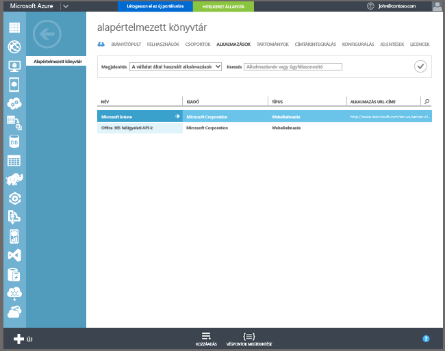

## A Windows 10 és a Windows 10 Mobile beállítása automatikus regisztrációra az Azure Active Directory Premium szolgáltatással

Az automatikus regisztrációval a felhasználók úgy regisztrálhatják vállalati tulajdonú vagy személyes Windows 10 rendszerű számítógépeiket és Windows 10 Mobile-eszközeiket az Intune-ban, hogy megadnak egy munkahelyi vagy iskolai fiókot és elfogadják, hogy felügyelet alá kerülnek. Ilyen egyszerű az egész! A háttérben a felhasználó eszköze regisztrálja magát és csatlakozik az Azure Active Directory-hoz. A regisztrációt követően az eszközt az Intune felügyeli.

**Előfeltételek**
- Azure Active Directory Premium-előfizetés ([próba-előfizetés](http://go.microsoft.com/fwlink/?LinkID=816845))
- Microsoft Intune-előfizetés

### Az automatikus MDM-regisztráció konfigurálása

1. Az [Azure felügyeleti portálján](https://manage.windowsazure.com) (https://manage.windowsazure.com) nyissa meg az **Active Directory** csomópontot és válassza ki a saját címtárát.

2. Kattintson az **Alkalmazások** fülre. A **Microsoft Intune** megjelenik az alkalmazások listáján.

    

3. Válassza a **Microsoft Intune**-hoz tartozó nyilat. A megjelenő lapon konfigurálhatja a Microsoft Intune-t.

4. A Microsoft Intune-ban való automatikus MDM-regisztráció konfigurálását a **Konfigurálás** elemre kattintva kezdheti meg.

5. A következő URL-címekhez használja az alapértelmezett értékeket:

  - **MDM-regisztráció**
  - **MDM-használati feltételek** 
  - **MDM-megfelelőség**

6.  Adja meg, hogy mely felhasználók eszközeit felügyelje a Microsoft Intune. E felhasználók Windows 10 rendszerű eszközeit a rendszer automatikusan belépteti a Microsoft Intune-felügyeletbe.

  - **Összes**
  - **CSOPORTOK**
  - **Nincsenek**

7. Válassza a **Mentés** elemet.
