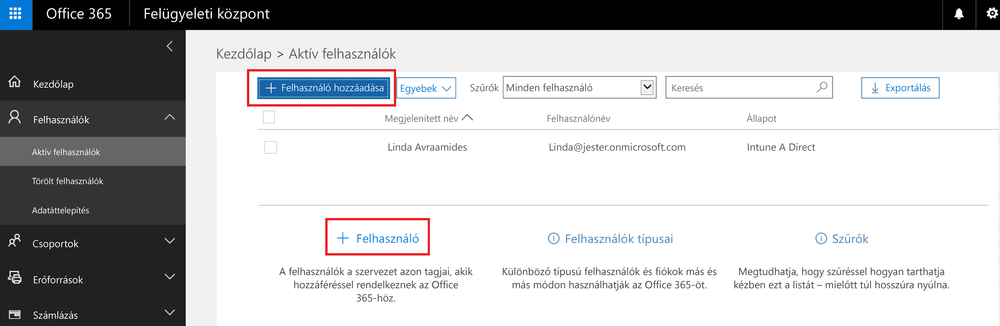
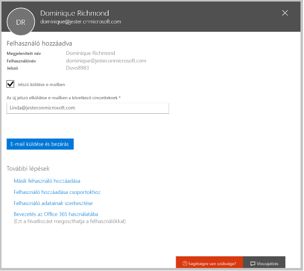
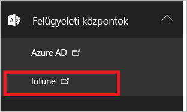
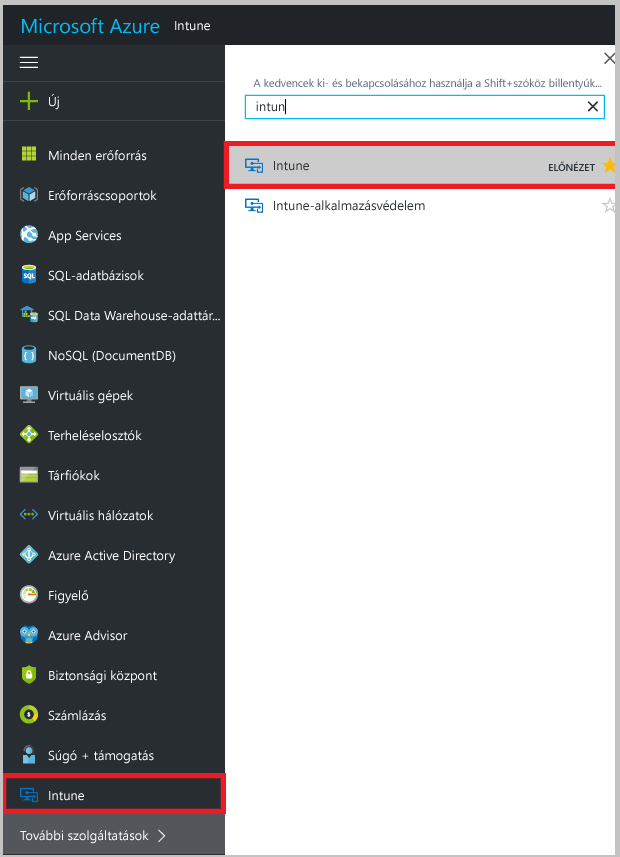

# Regisztráció a Microsoft Intune ingyenes próbaverziójára

[!INCLUDE[classic-portal](../includes/classic-portal.md)]

Ez a cikk végigvezeti Önt az Intune próbaverziójára való regisztráció lépésein, és előkészít egy pár felhasználót a próbaverzióhoz, ezáltal továbbléphet majd a kapcsolódó próbaverzióhoz készült útmutatóra, amely ismerteti, hogy hogyan kezel mobileszközöket az Intune. <!---or app data when devices are not enrolled in Intune.--->

>[!Note]
> 2016 decemberétől kezdve a Microsoft Intune az Azure-portálon érhető el, és bizonyos ingyenes próbára való regisztrációkat az Azure-beli Intune-ban, míg másokat a klasszikus Intune-ban lehet elvégezni. Ha az Ön próbaverziója az Azure-portálon érhető el, akkor a jelen cikkben leírtak elvégzése után jobban fogja tudni hasznosítani az [Azure-beli Intune előzetesével kapcsolatos tartalmakat](https://docs.microsoft.com/en-us/intune-azure/introduction/what-is-microsoft-intune).

## Előfeltételek
Ez a regisztrációs cikk és az útmutató a próbaverzióhoz feltételezi, hogy a próbaverziót kizárólag kipróbálás céljából használja, és előfizetéskor tiszta környezettel szeretne kezdeni.

Annak érdekébe, hogy megkönnyítsük Önnek a próba első lépéseit, egy nagyon egyszerű környezetet állítunk be, amely csak Intune-t használ, és feltételezi, hogy az Intune lesz az eszközkezelés egyetlen módja (más néven a mobileszköz-kezelő szolgáltató). Az útmutató során a részletesebb technikai tartalomra is felhívjuk figyelmét, ha mélyebbre szeretne ásni.

Az előfizetéses verzió minden funkciója elérhető a próbaverzióban, az egyetlen különbség az, hogy a próbaverzióban legfeljebb 100 felhasználói fiókja lehet.

## Regisztráció a próbaverzióra
Látogasson el az [Intune regisztrációs](https://portal.office.com/Signup/Signup.aspx?OfferId=40BE278A-DFD1-470a-9EF7-9F2596EA7FF9&dl=INTUNE_A&ali=1#0%20) oldalára, és töltse ki az űrlapot a próbaverzióra való regisztrációhoz.

Ha rendelkezik munkahelyi vagy iskolai fiókkal és azt szeretné használni az Intune próbaverziójához, akkor kövesse [ezeket a regisztrációs utasításokat](https://docs.microsoft.com/en-us/intune/get-started/start-with-a-paid-subscription-to-microsoft-intune-step-1). Azonban ez a cikk és az útmutató a próbaverzióhoz feltételezi, hogy nem használ ilyen fiókokat.

> [!TIP]
> Ha az informatikai műveletek és a felhasználók túlnyomó része nem az Ön földrajzi helyén van, akkor érdemes a teljesítmény teszteléséhez az előbbi földrajzi helyét megadni a próbaverzióban.

### A regisztrációt követően megfontolandó szempontok
Amikor próbaverziót regisztrál, e-mailben elküldjük a fiókadatait a regisztráció során megadott e-mail címre. Az e-mail megerősíti, hogy a próbaverzió aktív.

A regisztrációs folyamat befejezését követően átirányítjuk egy oldalra, amelyen az Office 365 felügyeleti központja segítségével felhasználókat vehet fel, illetve licenceket rendelhet a felhasználókhoz. Amikor legközelebb bejelentkezik a **klasszikus Intune**-ba (https://manage.microsoft.com), a rendszer automatikusan átirányítja az Intune felügyeleti konzoljára.

Ha próbaverziója az **Azure-portálon** érhető el, a https://portal.azure.com címen jelentkezzen be az Intune-próbaverzió hitelesítő adataival.

## Felhasználók hozzáadása
Mielőtt az Office 365 felügyeleti központból átlépne az Intune-ba, adjon hozzá egy pár felhasználót a próbafiókjához.

Az Office 365 felügyeleti központban hozzáadhat felhasználókat egyesével vagy tömegesen egy .csv-fájl feltöltésével. A próbaverzió beállításánál mindkettőt elvégezzük. A munkakörnyezetben viszont érdemes kihasználnia az Azure Active Directory felhasználói fiókok előnyeit, amelyekről további információt talál az [Első lépések útmutatónkban](https://docs.microsoft.com/en-us/intune/get-started/start-with-a-paid-subscription-to-microsoft-intune-step-3) és a jelen cikk [További lépések](#Next-steps) szakaszában.

### Egyéni felhasználó hozzáadása
1. Bármelyik lehetőséget választja a felhasználó hozzáadásához, nyisson meg egy űrlapot, amely lehetővé teszi a felhasználó létrehozását. Csak a csillaggal (\*) jelölt elemek szükségesek.

2.  A felhasználó hozzáadásakor utolsó lépésként küldjön e-mailt a felhasználónak, amely tartalmazza az ideiglenes Intune-jelszavát. A próbaverzióhoz használja a saját munkahelyi e-mail-címét, így megkapja a bejelentkezési információkat, és látja az e-mailt, amit a felhasználók kapnak. A teszteszköz regisztrációjához használhatja ezeket a felhasználói identitásokat. 

 

3. Ha rendszergazdai szerepkört szeretne hozzárendelni egy felhasználóhoz, miután létrehozta, akkor a szerepkör szerkesztéséhez az Office 365 felügyeleti központban válassza ki a felhasználók listájából a felhasználónevet, majd válassza a **Szerkesztés** lehetőséget a Szerepkör sorban a választható és a felhasználóhoz hozzárendelhető felhasználói szerepkörök listájának megtekintéséhez.

 

### Több felhasználó importálása
1. A több felhasználó importálását végző varázslót a **További** listában találja.

 

2. A .csv-file helyes beállításához segítséget nyújthat, ha letölt egy sablon fájlt, amelyre feltöltheti a felhasználói adatait. Ha megszeretné tekinteni, hogy pontosan milyen típusú adatok szükségesek az egyes mezőkhöz, töltse le a fejléceket és minta felhasználói információkat tartalmazó .csv-fájlt.

 

3. A .csv-fájl létrehozása és mentése után válassza a **Tallózás** elemet a fájl kiválasztásához. Ellenőrizze, majd kattintson a **Tovább** gombra. A rendszer feltölti a felhasználóit és hozzáadja őket az aktív felhasználók listájához.

> [!NOTE]
> A felhasználói nem jelennek meg az Intune-ban, amíg nem regisztrálnak egy kezelendő eszközt.

Most pedig térjünk át az Intune felügyeleti konzoljára, ahol elkezdheti felügyelni a felhasználókat, az eszközeiket és az alkalmazásaikat.

## Átlátható felügyelet
### Klasszikus Intune
A klasszikus Intune-hoz két portált fog használni:
- Az Office 365 Felügyeleti központot ([portal.office.com](https://portal.office.com))
- Az Intune felügyeleti konzolt ([manage.microsoft.com](https://manage.microsoft.com))

Többnyire az Intune felügyeleti konzoljában fog dolgozni, amelyet alább láthat. Ezen az oldalon állíthatja be és kezelheti a csoportjait, szabályzatait, eszközeit és alkalmazásait.

Az Office 365 felügyeleti központban (amelyet alább láthat) hozzáadhatja és kezelheti a felhasználókat, illetve a fiók más aspektusait, ideértve a számlázást és a támogatást is.

Az Office 365 felügyeleti központból átléphet az Intune felügyeleti konzoljába. A felügyeleti központok a bal oldali navigációs ablak utolsó eleme alatt találhatók. Válassza az **Intune** elemet az Intune felügyeleti konzoljának új ablakban való megnyitásához.

Az Intune-ból az Office 365 felügyeleti központba való visszajutáshoz válassza a **Felhasználók hozzáadása** feladatot a Csoportok – áttekintés oldalon.

### Azure-beli Intune – előzetes
Az Azure-beli Intune előzeteshez három portált fog használni:
- Az Office 365 Felügyeleti központot ([portal.office.com](https://portal.office.com))
- Az Intune-irányítópultot az Azure portálon ([portal.azure.com](https://portal.azure.com))
- A klasszikus Intune felügyeleti konzolt ([manage.microsoft.com](https://manage.microsoft.com))

Amikor először jelentkezik be az Azure-beli Intune-ba, akkor előfordulhat, hogy az nem jelenik meg az Azure-irányítópulton. Az Intune szolgáltatás felvétele az Azure-irányítópultra:
1. Az irányítópult bal oldalán, az Azure-szolgáltatások listájában kattintson a **További szolgáltatások >** elemre, és a keresőmezőbe írja be az Intune kifejezést.
2. Válassza a listából az **Intune** elemet, és a csillagra kattintva vegye fel a szolgáltatáslistára.  
3. A szolgáltatáslistában az **Intune** elemet választva nyithatja meg az Intune-irányítópultot.

Többnyire az alább látható Intune-irányítópulton fog dolgozni. Ezen az oldalon állíthatja be és kezelheti a csoportjait, szabályzatait, eszközeit és alkalmazásait. A klasszikus Intune felügyeleti portált az irányítópultról éri el, a **Klasszikus Intune-portál megnyitása** csempét választva. Ha vissza szeretne térni az Azure-beli Intune előzeteséhez, nyissa meg a https://portal.azure.com webhelyet a böngészőben, és válassza újból az **Intune** elemet a szolgáltatáslistából.

 

Az Office 365 felügyeleti központban (amelyet alább láthat) hozzáadhatja és kezelheti a felhasználókat, illetve a fiók más aspektusait, ideértve a számlázást és a támogatást is.

Ha az Office 365 felügyeleti központból szeretné elérni az Intune irányítópultot, nyissa meg a https://portal.azure.com webhelyet a böngészőben. Válassza a szolgáltatáslistából az **Intune** elemet.

Ha az Intune-ból szeretné elérni az Office 365 felügyeleti központot, nyissa meg a https://portal.office.com webhelyet a böngészőben. Ha már bejelentkezett az Intune-ba, akkor közvetlenül az Office 365 felügyeleti központba fog jutni.

## További lépések
### Klasszikus Intune
Kipróbálási forgatókönyv: [Mobileszköz-kezelés kipróbálása a Microsoft Intune-ban](mobile-device-management-trial-guide-microsoft-intune.md)

### Azure-beli Intune – előzetes
További tudnivalók az [Azure-beli Intune előzetes verziójáról](https://docs.microsoft.com/en-us/intune-azure/introduction/what-is-microsoft-intune)

### Integráció más termékekkel
Az Azure Active Directory felhasználói fiókok Intune-nal való használatával kapcsolatos további információk:
- [Identitáskövetelmények](https://docs.microsoft.com/en-us/active-directory/active-directory-hybrid-identity-design-considerations-overview#design-considerations-overview)
- [A címtár-szinkronizálás követelményei](https://docs.microsoft.com/en-us/active-directory/active-directory-hybrid-identity-design-considerations-directory-sync-requirements)
- [Többtényezős hitelesítés követelményei](https://docs.microsoft.com/en-us/active-directory/active-directory-hybrid-identity-design-considerations-multifactor-auth-requirements)

További információk [Az Intune és a System Center Configuration Manager együttes használatáról](https://docs.microsoft.com/en-us/sccm/mdm/understand/hybrid-mobile-device-management)

<!--HONumber=Dec16_HO3-->

