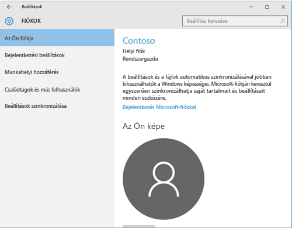
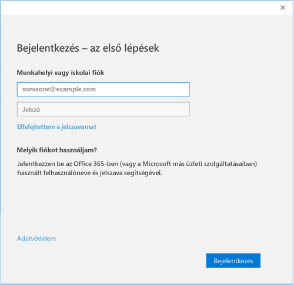

# A Windows 10-eszközök regisztrálása az Intune vállalati portál

A szervezet felügyeleti csoportban a Windows 10 rendszerű eszköz regisztrálása a Intune vállalati portál használatával. Ez a cikk bemutatja, hogyan regisztrálhat eszközöket a Windows 10 1607-es és újabb verziók, és a Windows 10 1511-es és korábbi. Mielőtt elkezdené, győződjön meg arról, hogy [ellenőrizze a verziót az eszközén](windows-enrollment-company-portal.md#find-windows-10-version-number) , hogy a megfelelő lépéseket követnie.  

Windows 10 asztali, telefonos és táblagépes különböző eszköztípusok között támogatott. A regisztráció lépései megegyeznek az bármelyik eszközt használja. A képernyő azonban némileg eltérően jelenik meg ebben a cikkben a lemezképek alapján is meg.  
 
> [!VIDEO https://www.youtube.com/embed/TKQxEckBHiE?rel=0]

## A Windows 10 1607-es verzió és az újabb eszközök regisztrálása 
Ezeket a lépéseket ismertetjük a Windows 10-es, 1607-es és újabb verzióját futtató eszközök regisztrálásához.  

1. Lépjen a **Start** menüre. Ha a Windows 10 Mobile-eszközön, továbbra is a **minden alkalmazás** listája.

2. Nyissa meg a **beállítások** alkalmazást. Ha az alkalmazás nem könnyen elérhető, az alkalmazások listájában, nyissa meg a keresősáv és írja be a "beállítások".

3. Válassza a **Fiókok** > **Hozzáférés munkahelyi vagy iskolai rendszerhez** > **Csatlakozás** elemet.  

      

4. Adja meg a munkahelyi vagy iskolai e-mail-címét, és válassza a **Tovább** elemet.  

     

5. Jelentkezzen be az Intune-ba munkahelyi vagy iskolai fiókjával.  

      

    Végül megjelenik egy üzenet, hogy munkahelye vagy iskolája regisztrálja az eszközt.

6. Ha a szervezet megköveteli, hogy egy PIN-kódot a Windows Hello beállítása, kérni fogja, adjon meg egy ellenőrző kódot. Írja be a kódot, és folytassa a képernyőn látható lépéseket PIN-kód létrehozását.  

7. Az a **készen vagyunk!** képernyő, válassza a **Kész** elemet. Ezzel megtörtént az eszköz regisztrálása.  

8. Ellenőrizze a kapcsolatot, lépjen vissza **beállítások** > **fiókok** > **hozzáférés munkahelyi vagy iskolai**.  A fiók mostantól szerepelnie kell.  

      

Még mindig nem fér hozzá a munkahelyi vagy iskolai e-mailjeihez, fájljaihoz vagy egyéb adataihoz? Ismerje meg, hogyan [fiókkal kapcsolatos problémák elhárítása](troubleshoot-your-windows-10-device-windows.md#troubleshooting-steps-to-follow-if-you-see-access-work-or-school).  

## A Windows 10 rendszer 1511-es és korábbi eszköz regisztrálása  
Ezeket a lépéseket ismertetjük a Windows 10-es, 1511-es és korábbi verzióját futtató eszközök regisztrálásához.  

1. Lépjen a **Start** menüre. Ha a Windows 10 Mobile-eszközön, továbbra is a **minden alkalmazás** listája.

2. Nyissa meg a **beállítások** alkalmazást. Ha az alkalmazás nem könnyen elérhető, az alkalmazások listájában, nyissa meg a keresősáv és írja be a "beállítások".

3. Válassza ki **fiókok** > **fiókja**.  

      

5. Válassza a **Munkahelyi vagy iskolai fiók beállítása** lehetőséget.  

      

6. Jelentkezzen be a munkahelyi vagy iskolai fiókjával.  

      

Még mindig nem fér hozzá a munkahelyi vagy iskolai e-mailjeihez, fájljaihoz vagy egyéb adataihoz? Ismerje meg, hogyan [fiókkal kapcsolatos problémák elhárítása](troubleshoot-your-windows-10-device-windows.md#troubleshooting-steps-to-follow-if-you-see-your-account) regisztráció során.  

## Informatikai rendszergazdai támogatás   

Ha egy informatikai rendszergazdája, és futtassa problémák eszközök regisztrálásakor, [eszközregisztrációs problémák hibaelhárítása a Windows Microsoft Intune-ban](https://support.microsoft.com/help/4469913). Ez a cikk felsorolja a gyakori hibák, azok okok, és lépéseket a problémák megoldásához. 

## További lépések  
Ha a vállalati portál vagy a regisztráció segítségre van szüksége, lépjen kapcsolatba a szervezet informatikai támogatási csoportjának. Talál meg kapcsolattartási adatait a [céges portál webhelyen](https://go.microsoft.com/fwlink/?linkid=2010980). Jelentkezzen be munkahelyi vagy iskolai fiókját a helyhez.  

 

