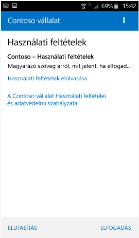

# Android-eszköz regisztrálása az Intune-ban

Ha munkahelye vagy iskolája a Microsoft Intune-t használja, Android-eszközének regisztrálásával hozzáférhet a vállalati levelezéséhez, fájljaihoz és egyéb vállalati forrásokhoz. Az eszközök regisztrálása lehetővé teszi az informatikai osztály számára ezeknek a munkahelyi vagy iskolai erőforrásoknak a kezelését és védelmét, miközben Ön a kívánt eszközön végezheti a feladatait. További információk a regisztrációval kapcsolatban: [Mi történik a Céges portál alkalmazás telepítésekor és az eszköz regisztrálásakor?](what-happens-if-you-install-the-Company-Portal-app-and-enroll-your-device-in-intune-android.md)

> [!VIDEO https://channel9.msdn.com/Series/IntuneEnrollment/Android-Enrollment/player]

Ezek a regisztrálási útmutatók a natív és a Samsung Knox Android-eszközökre vonatkoznak. A Samsung Knox olyan biztonsági szolgáltatás, amelynek segítségével bizonyos Samsung-eszközöknek további védelmet biztosíthat a natív Android nyújtotta lehetőségeken felül. A **Beállítások** > **Az eszköz névjegye** területen megállapíthatja, hogy Samsung Knox-eszközzel rendelkezik-e. Ha nem szerepel a „Knox-verzió” kifejezés, akkor natív Android-eszközzel rendelkezik.

A regisztráció előtt vagy után a rendszer megkérheti, hogy válasszon ki egy olyan kategóriát, amely a leginkább illik az Ön eszközhasználatára. A cég informatikai támogatási szolgálata ezen a kategórián keresztül segít ellenőrizni az alkalmazásokat, amelyekhez hozzáfér.

**Android-eszköz regisztrálása:**

1. Telepítse az Intune Vállalati portál nevű ingyenes alkalmazást a [Google Play áruházból](http://play.google.com/store/apps/details?id=com.microsoft.windowsintune.companyportal).

2. Nyissa meg a Vállalati portál alkalmazást.

3. A Vállalati portál alkalmazás **üdvözlőképernyőjén** koppintson a **Bejelentkezés** elemre, és jelentkezzen be a munkahelyi vagy az iskolai fiókjával.

      

4. Ha a cég informatikai támogatási szolgálata kikötéseket és feltételeket írt elő a munkahely erőforrásainak használatához, az **ELFOGADÁS** gombra koppintva fogadja el őket. A képernyő a használt Android-verziótól függően kismértékben eltérhet az alábbi képtől.

   

5. Jelentkezzen be a Vállalati portál alkalmazásba a munkahelyi vagy az iskolai e-mail címének és jelszavának használatával, majd koppintson a **Bejelentkezés** elemre.

   

6. A **Vállalati hozzáférés beállítása** képernyőn koppintson a **FOLYTATÁS** elemre.

   

   > [!NOTE]
   > A sárga háromszög nem hibát jelez, hanem azt mutatja, hogy néhány lépés még hátravan a regisztráció folyamatából.

7. Tekintse át a listában, hogy a cég informatikai támogatási szolgálata milyen tartalmakhoz férhet hozzá az eszközén, majd koppintson a **FOLYTATÁS** gombra.

   

8. A **Következő lépések** képernyőn olvassa el, mi történik a regisztráció során, majd koppintson a **REGISZTRÁCIÓ** elemre.

   

9. Ha az Android 6.0-s vagy újabb verzióját használja, végezze el ezt a lépést. Egyéb esetben lépjen a következő lépésre.

   Ha a cég informatikai támogatási szolgálata létrehozott bizonyos szabályzatokat, akkor előfordulhat, hogy megjelennek az alábbi üzenetek:
   - **Allow Company Portal to make and manage phone calls? (Engedélyezi, hogy a Munkahelyi portál alkalmazás telefonhívásokat indítson és kezeljen?)**

     

   Ha ez az üzenet jelenik meg, koppintson az **ENGEDÉLYEZÉS** elemre. Nyugodtan rákoppinthat az ENGEDÉLYEZÉS elemre, mert **a Microsoft soha nem indít telefonhívásokat, és nem is kezeli az Ön hívásait**! A Google szabályozza az üzenet szövegét, és a Microsoft nem módosíthatja azt. A hozzáférés engedélyezésekor csupán annyi történik, hogy engedélyezi az eszköz számára az eszköz nemzetközi mobilkészülék-azonosító (IMEI) számának elküldését az Intune-nak. A sorozatszámhoz hasonló IMEI szám a mobileszköz egyedi azonosítója.

   Ha megtagadja a hozzáférést, az üzenet ismét megjelenik, amikor legközelebb bejelentkezik a Vállalati portálba, de a **Ne kérdezzen rá ismét** jelölőnégyzetre koppintva kikapcsolhatja a további üzeneteket. Amennyiben később ismét engedélyezni szeretné a hozzáférést, a **Beállítások** &gt; **Alkalmazások** &gt; **Vállalati portál** &gt; **Engedélyek** &gt; **Telefon** lapon teheti ezt meg.

   - **Allow Company Portal to access your contacts? (Engedélyezi, hogy a Munkahelyi portál hozzáférjen a névjegyekhez?)**

     

     Ha ez az üzenet jelenik meg, koppintson az **ENGEDÉLYEZÉS** elemre. Nyugodtan rákoppinthat az ENGEDÉLYEZÉS elemre, mert **a Microsoft soha nem fér hozzá a névjegyekhez.** A Google szabályozza az üzenet szövegét, és a Microsoft nem módosíthatja azt. Ha engedélyezi a hozzáférést, lehetővé teszi a Vállalati portál alkalmazásnak munkahelyi fiók létrehozását, használatát és kezelését.

     Ha megtagadja a hozzáférést, az üzenet ismét megjelenik, amikor legközelebb bejelentkezik a Vállalati portálba, de a **Ne kérdezzen rá ismét** jelölőnégyzetre koppintva kikapcsolhatja a további üzeneteket. Amennyiben később ismét engedélyezni szeretné a hozzáférést, a **Beállítások** &gt; **Alkalmazások** &gt; **Vállalati portál** &gt; **Engedélyek** &gt; **Telefon** lapon teheti ezt meg.

10. Az **Activate device administrator** (Eszközadminisztrátor aktiválása) képernyőn koppintson az **Aktiválás** elemre.

    

    A Céges portálnak az eszközfelügyelethez eszközadminisztrátori szerepkörre van szüksége. Ez feljogosítja a rendszergazdát bizonyos információ megnézésére (például hogy Ön hányszor próbálta meg feloldani a zárolási képernyőt), és bizonyos műveletek elvégzésére.

    Fontos szem előtt tartani, hogy ezek a műveletek a nagyobb biztonságot szolgálják. A cég informatikai támogatási szolgálata nem az Ön bizalmas adataihoz akar hozzáférni és nem törli őket ok nélkül, csak gondoskodni szeretne a céges adatok biztonságáról.

    A Microsoftnak nincs befolyása erre az üzenetre, és értjük, hogy a megfogalmazása drasztikusnak tűnhet, de a Céges portál nem tudja csak azokat a korlátozásokat és hozzáféréseket megjeleníteni, amelyek az adott szervezetre érvényesek: csak ezek mindegyikét lehet egyszerre engedélyezni ezen a képernyőn. Ha az eszköz szervezeti használatával kapcsolatos kérdése van, a [Céges portál webhelyen](https://portal.manage.microsoft.com#HelpDeskDialog) látható elérhetőségek valamelyikén kérjen tájékoztatást a cég informatikai támogatási szolgálatától.

11. Az útmutatást követve írja be a PIN-kódját vagy a jelszavát. Ha korábban már beállított egy PIN-kódot vagy egy jelszót a szóban forgó eszközön, ez a képernyő nem jelenik meg, és új PIN-kódot vagy jelszót sem kell megadnia.

    

12. Ha Samsung Knox-eszközt használ, koppintson a **Megerősítés** elemre. Ekkor megjelenik egy üzenet, hogy az eszköz regisztrálása folyamatban van. Ha natív Android-eszközt használ, akkor csak egy üzenet jelenik meg arról, hogy az eszköz regisztrálása folyamatban van, ahogy az alábbi képernyőképen látható.

    

    Ezen a képernyőképen az látható, hogy az eszköz regisztrálása folyamatban van.

    

13. Amikor megjelenik a **Vállalati hozzáférés beállítása** képernyő, koppintson a **FOLYTATÁS** elemre. Ha megjelenik egy üzent arról, hogy az eszköz nem megfelelő, kövesse az utasításokat a probléma megoldásához, majd koppintson a **FOLYTATÁS** elemre.

    

    

    A részletek megtekintéséhez koppintson a problémára.

    

      

14. A **Vállalati hozzáférés beállítása befejeződött** képernyőn koppintson a **KÉSZ** elemre. Ezzel megtörtént az eszköz regisztrálása.

    

Mielőtt vállalati alkalmazások telepítésével próbálkozna, a **Beállítások** &gt; **Biztonság** területen kapcsolja be az **Ismeretlen források** beállítást. Ha az alkalmazások telepítésének megkísérlése előtt nem kapcsolja be ezt a beállítást, a következő üzenet jelenik meg: „A telepítés letiltva. Biztonsági okokból az eszköz blokkolja az ismeretlen forrásból származó alkalmazások telepítését.” A hiba-párbeszédpanelen található **Beállítások** elemre koppintva könnyen az **Ismeretlen források** beállításhoz ugorhat.

> [!Note]
> Ha a szervezete távközlésiköltség-kezelő szoftvert használ, az eszköz teljes regisztrálásához még néhány lépést el kell végezni. További információért [kattintson ide](enroll-your-device-with-telecom-expense-management-android.md).

Ha hibaüzenet jelenik meg az eszköz Intune-regisztrálása közben, akkor a [regisztrálási hibák elküldhetők a cég informatikai támogatási szolgálatának](send-enrollment-errors-to-your-it-admin-android.md).

További segítségre van szüksége? Forduljon a cég informatikai támogatási szolgálatához (a kapcsolattartási adatokat a [céges portál webhelyén](https://portal.manage.microsoft.com#HelpDeskDialog) találja), vagy írjon a <a href="mailto:wintunedroidfbk@microsoft.com?subject=I'm having trouble with enrolling my Android device&body=Describe the issue you're experiencing here.">Microsoft Android-csapatának</a>.
