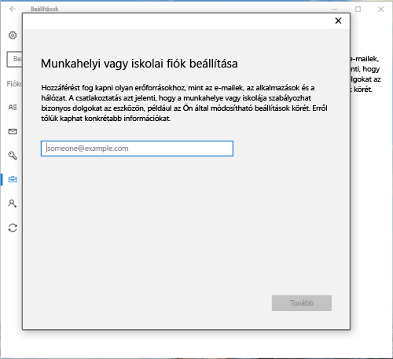
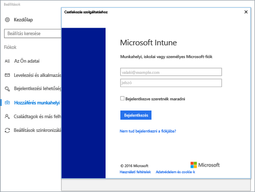
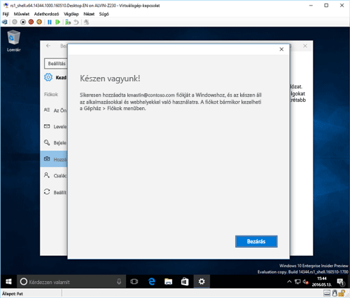

# Windows 10 rendszerű eszköz regisztrálása az Intune-ban

> [!NOTE]
> A Windows 10 az összes eszköztípuson működik. Akár asztali gépet, akár telefont vagy táblagépet használ, a lépések ugyanazok lesznek – még ha némileg eltérnek is az itt látható képektől.

> [!VIDEO https://channel9.msdn.com/Series/IntuneEnrollment/Windows-Enrollment/player]

1. Lépjen a **Start** menüre.

   - Ha **Windows 10 rendszerű asztali** eszközt használ, lépjen a **Start** menüre.
   - Ha **Windows 10 Mobile** rendszerű eszközt használ, nyissa meg a **kezdőképernyőt**, és pöccintsen a **Minden alkalmazás** listára.

2. A keresősávban keressen a „beállítások” kifejezésre, majd nyissa meg a Windows **Beállítások** alkalmazását.

3. Válassza a **Fiókok** > **Hozzáférés munkahelyi vagy iskolai rendszerhez** > **Csatlakozás** elemet.

    

4. Adja meg a munkahelyi vagy iskolai e-mail-címét, és válassza a **Tovább** elemet.

   

5. Jelentkezzen be az Intune-ba munkahelyi vagy iskolai fiókjával.

    

    Ekkor megjelenik egy üzenet arról, hogy a munkahely vagy iskola regisztrálja az eszközt.

6. Amikor megjelenik a **Készen vagyunk!** képernyő, válassza a **Bezárás** elemet. Ezzel készen is van.

   

7. Ha szeretné még egyszer ellenőrizni, hogy a kapcsolat megfelelően működik-e, lépjen vissza a **Gépház** területre, ahol most már meg kell jelennie a listán a munkahelyi vagy iskolai fiókjának.

    

Ha követte a fenti lépéseket, de továbbra sem tud hozzáférni munkahelyi vagy iskolai e-mail fiókjához és fájljaihoz, kövesse a [Hibaelhárítási teendők, ha ezt látja: Hozzáférés munkahelyi vagy iskolai rendszerhez](troubleshoot-your-windows-10-device-windows.md#troubleshooting-steps-to-follow-if-you-see-access-work-or-school) című részben leírt lépéseket.
