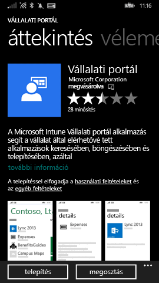
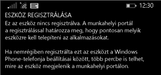

# Windows Phone 8.1-eszköz regisztrálása az Intune-ban

Ha munkahelye vagy iskolája a Microsoft Intune-t használja, eszközének regisztrálásával hozzáférhet a vállalati levelezéséhez, fájljaihoz és egyéb vállalati erőforrásaihoz. Ha regisztrálja az eszközeit, azzal a szervezete megóvhatja a vállalati adatokat. További információk a regisztrációval kapcsolatban: [Mi történik a Vállalati portál alkalmazás telepítésekor és az eszköz Intune-beli regisztrálásakor?](what-happens-if-you-install-the-company-portal-app-and-enroll-your-device-in-intune-windows.md), illetve [Mit láthat a rendszergazda az eszközén, és mit nem?](what-info-can-your-company-see-when-you-enroll-your-device-in-intune.md) témakörben.

Az Phone 8.1 rendszerű eszköznek az Intune-ban való regisztrálásához kövesse a vállalatára vagy iskolájára érvényes utasításokat:

-   [Ha vállalata engedélyezi, hogy használja a Windows Áruházból elérhető Vállalati portál alkalmazást](#if-your-company-lets-you-use-the-company-portal-from-the-windows-store)

-   [Ha nincs engedélye arra, hogy elérje a Windows Áruházat a Windows Phone-telefonjáról, vagy ha nincs Microsoft-fiókja](#if-you-are-not-allowed-to-access-the-windows-store-from-your-windows-phone-or-if-you-do-not-have-a-microsoft-account)

## Ha vállalata engedélyezi, hogy használja a Windows Áruházból elérhető Vállalati portál alkalmazást
Telepítse az eszközre a Vállalati portál alkalmazást:

1.  Koppintson a **Start** &gt; **Áruház** parancsra.

2.  Koppintson a **Keresés** elemre, majd írja be a **vállalati portál** kifejezést.

3.  Az eredmények listájában koppintson a **Vállalati portál** elemre.

    

4.  Koppintson a **Vállalati portál**  &gt; **Telepítés** elemre.

    

Regisztrálja az eszközt:

1.  Nyissa meg az eszközön a **Microsoft Intune Vállalati portál** alkalmazást.

2.  Adja meg a hitelesítő adatait. Előfordulhat, hogy az alkalmazás megkéri vállalata esetleges használati feltételeinek elfogadására.

3.  Pöccintéssel lépjen az **Eszközök** területre.

4.  Koppintson a **Koppintson ide az eszköz regisztrálásához vagy azonosításához** elemre.

    

5.  Koppintson **Az eszköz regisztrálása** elemre.

    

6.  Koppintson a **Fiók hozzáadása** elemre.

    

7.  Adja meg a kért további információkat, majd fejezze be a regisztrációt a **bejelentkezés** elemre koppintva. Most látnia kell a munkahelyi fiókját a **Beállítások** &gt; **Munkahely** lap listájában.

    

## Ha nincs engedélye arra, hogy elérje a Windows Áruházat a Windows Phone-telefonjáról, vagy ha nincs Microsoft-fiókja

1.  Koppintson a  **Beállítások** &gt; **Munkahely** elemre.

2.  Koppintson a **fiók hozzáadása** elemre, majd jelentkezzen be a munkahelyi fiókjával.

3.  Adja meg a kért további információkat, majd fejezze be a regisztrációt a **bejelentkezés** elemre koppintva.

4.  Ha a rendszer kéri a vállalati alkalmazás vagy központ telepítését, jelölje be a megfelelő jelölőnégyzetet, majd koppintson a **kész** gombra.

Ha a rendszergazda úgy állította be a Vállalati portál alkalmazást, hogy az a regisztráció során települjön, a Vállalati portál megjelenik az alkalmazáslistában.

További segítségre van szüksége? Forduljon a rendszergazdához. Az elérhetőségét keresse meg a [Vállalati portál webhelyén](http://portal.manage.microsoft.com).
