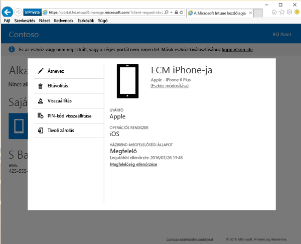

# Az eszköz távoli zárolása a Vállalati portál webhelyéről

Történhetnek balesetek, és néha előfordulhat, hogy eltűnnek eszközök. Ha az eszköz elveszett vagy ellopták, leginkább amiatt aggódhat, hogy bárki hozzáférhet a rajta lévő adatokhoz, akárhol is legyen az eszköz.

[!INCLUDE[wit_nextref](includes/end-user-password-guidance.md)]

A biztonság kedvéért zárolhatja azt a Távoli zárolás lehetőséggel a [Vállalati portál webhelyén](https://portal.manage.microsoft.com#HelpDeskDialog). A Távoli zárolás a következő rendszereken használható:

* Android
* iOS
* macOS
* Windows 10
* Windows 10 Mobile (ha az eszközön már volt beállítva jelszó)
* Windows Phone 8.1 (ha az eszközön már volt beállítva jelszó)

## A Távoli zárolás funkció használata az eszköz zárolásához

1.  A [Céges portál webhelyen](https://portal.manage.microsoft.com#HelpDeskDialog) koppintson a __menü__ gombra, majd válassza a __Saját eszközök__ lehetőséget.

2. A __Saját eszközök__ oldalon válassza ki a zárolni kívánt eszköz nevét.

  

3.  Az adott eszköz lehetőségei egy előreugró ablakban nyílnak meg. Koppintson a **Távoli zárolás** gombra.

    

4.  Ekkor megjelenik egy értesítés, mely arról tájékoztatja, hogy az eszköz zárolására készül. Koppintson a **Távoli zárolás** lehetőségre, és a Vállalati portál webhelye megpróbálja zárolni az eszközt.

    Miután kiválasztotta a **Távoli zárolás** lehetőséget, a „Távoli zárolás függőben” üzenet fog megjelenni.  Ha a távoli zárolás sikeres, az állapot a „Sikeres volt a távoli zárolás” állapotra változik.

    A Távoli zárolás állapota három helyen jelenik meg:

    * A webhely értesítési területén.
    * Az eszköz **Részletek** lapján.
    * Az oldal **Eszközeim** területén, az eszköz nevét megjelenítő csempén.

> [!Note]
> Ha „A távoli zárolás nem sikerült” értesítés jelenik meg, néhány perc várakozás után próbálkozzon újra az eszköz zárolásával. Amikor újra próbálkozik, az állapot ismét „Távoli zárolás függőben” lesz. Ha az újrapróbálkozás sem sikerül, forduljon a cég informatikai támogatási szolgálatához.

Ha eszközét megtalálja, és a Távoli zárolás funkció használata után szeretné feloldani a zárolását, egyszerűen adja meg a jelszavát.

További segítségre van szüksége? Forduljon a cég informatikai támogatásához. Az elérhetőségét keresse meg a [Vállalati portál webhelyén](https://portal.manage.microsoft.com#HelpDeskDialog).
