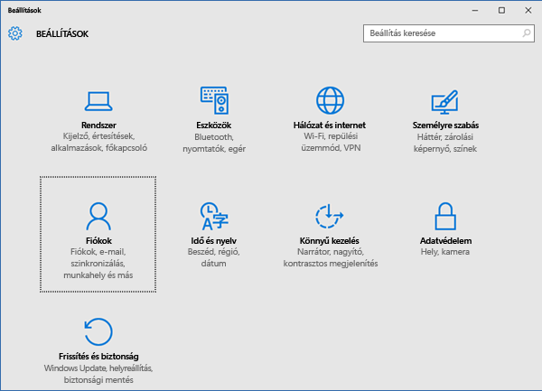
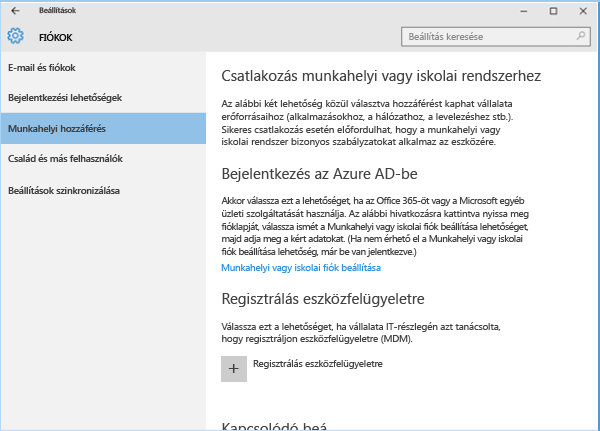
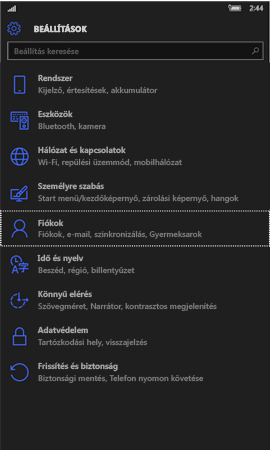
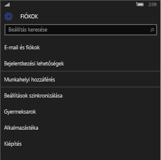
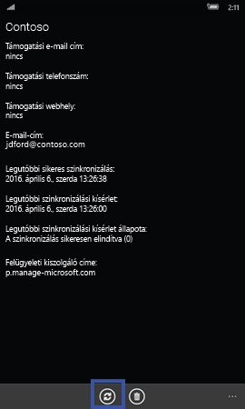
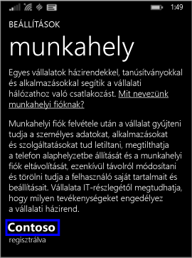

# Windows-eszköz manuális szinkronizálása

Ha nem elég gyors az alkalmazástelepítés, kezdeményezzen manuális eszközszinkronizálást. A manuális szinkronizálással kényszerítheti az eszközt az Intune-hoz való csatlakozásra és a legújabb frissítések és kommunikáció letöltésére. Az eszközszinkronizálás után felgyorsulhat a telepítés.

Az Intune a Céges portál alkalmazásból, az asztali tálcáról vagy a Start menüből, valamint az eszköz Beállítások alkalmazásából támogatja a manuális szinkronizálást. 

A Céges portál alkalmazás csak a Windows 10 alkotói frissítését (1703) vagy újabb verziót futtató eszközökön érhető el. 
* [Szinkronizálás a Céges portál alkalmazásból](#Sync-from-Company-Portal-app-for-Windows)  

Minden Windows-eszköz szinkronizálható az eszköz Beállítások alkalmazásából, beleértve a következőket:

* [Windows 10 asztali verzió](#windows-10-desktop)  
* [Microsoft HoloLens](#microsoft-hololens)   
* [Windows 10 Mobile](#windows-10-mobile)  
* [Windows Phone 8.1](#windows-phone-81)    

## Szinkronizálás közvetlenül a windowsos Céges portál alkalmazásból
Az alkotói frissítést (1703) vagy újabb verziót futtató Windows 10-es eszközök manuális szinkronizálásához kövesse az alábbi lépéseket.

1.  Nyissa meg az eszközén a Céges portál alkalmazást.

2.  Válassza a **Beállítások** > **Szinkronizálás** lehetőséget.

      
    
      

## Szinkronizálás az eszköz tálcájáról vagy Start menüjéből   

A szinkronizálás vezérlőjét az alkalmazáson kívülről is elérheti az eszköz asztalán. Ez a módszer akkor hasznos, ha az alkalmazás rögzítve van közvetlenül a tálcán vagy a Start menüben, és gyorsan szeretné szinkronizálni azt.  

1. Keresse meg a Céges portál alkalmazás ikonját a tálcán vagy a Start menüben.  
2. Kattintson a jobb gombbal az alkalmazás ikonjára a menü (más néven gyorslista) megjelenítéséhez.  

      

3. Válassza ki az **Eszköz szinkronizálása** lehetőséget. Megnyílik a Céges portál alkalmazás **Beállítások** lapja, és megkezdődik a szinkronizálás.  

## Szinkronizálás a Beállítások alkalmazásból 
A Microsoft HoloLenses, Windows 10 asztali verziós, Windows 10 Mobile-os vagy Windows Phone 8.1-es eszközének a Beállítások alkalmazásból történő szinkronizálásához kövesse az alábbi lépéseket.  

### Windows 10 asztali verzió
1. Az eszközön válassza a **Start** > **Beállítások** lehetőséget.

2. Válassza a **Fiókok** elemet.

      

3. A Windows 10 több asztali verzióval is rendelkezik. Hasonlítsa össze a képernyőjét a lenti képernyőképekkel, így megtudhatja, melyik útmutatást kell követnie. 

    * Ha a képernyőjén **Hozzáférés munkahelyi vagy iskolai rendszerhez** felirat látható, ugorjon a [Hozzáférés munkahelyi vagy iskolai rendszerhez](#access-work-or-school) szakaszhoz.

      

    * Ha a képernyőn a **Munkahelyi hozzáférés** felirat jelenik meg, ugorjon a [Munkahelyi hozzáférés](#work-access) szakaszhoz.  

    

#### Hozzáférés munkahelyi vagy iskolai rendszerhez – lépések

1. Kattintson a **Hozzáférés munkahelyi vagy iskolai rendszerhez** elemre.

      

2. Válassza ki azt a fiókot, amely mellett egy aktatáska ikon látható. Ha nem lát ilyen fiókot, előfordulhat, hogy a cége másképp konfigurálta a beállításokat. Ebben az esetben kattintson arra a fiókra, amely mellett egy Microsoft-embléma látható.

     

3. Kattintson az **Információ** lehetőségre. 

4. Kattintson a **Szinkronizálás** elemre. 

#### Munkahelyi hozzáférés – lépések

1.  Kattintson a **Munkahelyi hozzáférés** elemre.

    

2. A **Regisztrálás eszközfelügyeletre** részen válassza ki a cég nevét.

    

3. Kattintson a **Szinkronizálás** elemre. A gomb a szinkronizálás végéig le van tiltva.

      

### Windows 10 mobil verzió

   1. Az eszközön lépjen a **Minden alkalmazás** > **Beállítások** > **Fiókok** menüpontra.

       

   2. Válassza a **Munkahelyi hozzáférés** lehetőséget.

       

   3. A **Regisztrálás eszközfelügyeletre** területen válassza ki a cég nevét.

       

   4. Kattintson a **Szinkronizálás** ikonra. A gomb a szinkronizálás végéig le van tiltva.

         
### Microsoft HoloLens  
Ezek az utasítások a Windows 10 évforduló frissítés (más néven RS1-et) futtató HoloLens-eszközökre vonatkoznak. 
1.  Nyissa meg a Beállítások alkalmazást az eszközön.  

2.  Kattintson a **Fiókok** > **Munkahelyi hozzáférés** elemre.  
      

3.  Válassza ki a csatlakoztatott fiókot, majd válassza a **Szinkronizálás** lehetőséget.   

### Windows Phone 8.1

1. Lépjen a **Minden alkalmazás** > **Beállítások** > **Munkahely** menüpontra.

    

2. Válassza ki a cég nevét.

    

3. Kattintson a **Szinkronizálás** ikonra.

    

További segítségre van szüksége? Forduljon a cég informatikai támogatásához. Az elérhetőségét keresse meg a [Vállalati portál webhelyén](https://go.microsoft.com/fwlink/?linkid=2010980).
