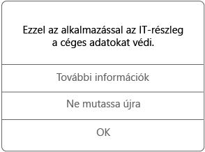

# Felügyelt alkalmazások használata iOS-eszközön

A felügyelt alkalmazások olyan alkalmazások, amelyeket a cég informatikai támogatási szolgálata beállíthat a rajtuk keresztül elérhető vállalati adatok védelme érdekében. Amikor iOS-es eszközön felügyelt alkalmazásban fér hozzá vállalati adatokhoz, észreveheti, hogy az alkalmazás a várttól kissé eltérően működik. Előfordulhat például, hogy nem tudja másolni és beilleszteni a védett vállalati adatokat, vagy nem tudja menteni az adatokat bizonyos helyekre.

A különböző felügyelt alkalmazások együtt is működhetnek az eszközön annak érdekében, hogy el tudja végezni mindennapos feladatait, miközben a vállalati adatok védelméről is gondoskodnak. Ha például megnyit egy vállalati fájlt egy felügyelt alkalmazásban, és egy másik alkalmazásra van szükség a fájl megtekintéséhez, a szükséges alkalmazás automatikusan megnyílik. Ha egy szükséges alkalmazás nem érhető el, akkor előfordulhat, hogy bizonyos műveletek, például a dokumentumok vagy a felügyelt dokumentumokban található webes hivatkozások megnyitása nem végezhetők el.

Amikor felügyelt alkalmazásban fér hozzá vállalati adatokhoz, az alábbihoz hasonló üzenet jelenik meg, amely tudatja, hogy egy felügyelt alkalmazást nyitott meg.

### Hogyan szerezhetők be a felügyelt alkalmazások?
Különböző módokon szerezhet be felügyelt alkalmazásokat:

-   Ha az eszköze regisztrálva van a Microsoft Intune-nal, akkor telepítheti az alkalmazást a Céges portál alkalmazásból vagy a Céges portál webhelyről, illetve a cég informatikai támogatási szolgálata is telepítheti azt az eszközére. A regisztrálással kapcsolatban lásd: [iOS-eszköz regisztrálása az Intune-ban](enroll-your-device-in-intune-ios.md), illetve [MacOS-eszköz regisztrálása az Intune-ban](enroll-your-device-in-intune-macos.md).

-   Alkalmazást telepíthet az App Store-ból is, majd bejelentkezhet az Intune által felügyelt vállalati felhasználói fiókjával.

Egyes esetekben előfordulhat, hogy a cég informatikai támogatási szolgálata egy telepített alkalmazáshoz több licencet is vásárol. Ha egy olyan üzenet jelenik meg, amely arra kéri, hogy fogadja el az Apple Volume Purchase Program szerződését, ez teljesen normális, és elfogadhatja. Ha nem fogadja el, nem fogja tudni telepíteni az alkalmazást.

### Mit felügyelhet a cég informatikai támogatási szolgálata az alkalmazásokban?
Itt talál néhány példát arra, hogy melyek lehetnek azok a cég informatikai támogatási szolgálata által az alkalmazásokban felügyelt elemek, amelyek hatással lehetnek a vállalati adatok használatára az eszközön:

-   Adott webhelyek hozzáférése

-   Adatátvitel alkalmazások között

-   Fájlok mentése

-   Másolási és beillesztési műveletek

-   PIN-hozzáférési követelmények

-   Vállalati hitelesítő adatokkal végzett bejelentkezés

-   Biztonsági mentés létrehozásának lehetősége a felhőben

-   Képernyőfelvételek készítésének lehetősége

-   Adattitkosítási követelmények

Az eszközén lévő felügyelt alkalmazásokról további információért lépjen kapcsolatba a cég informatikai támogatási szolgálatával. Az elérhetőségét keresse meg a [Vállalati portál webhelyén](https://portal.manage.microsoft.com#HelpDeskDialog).
