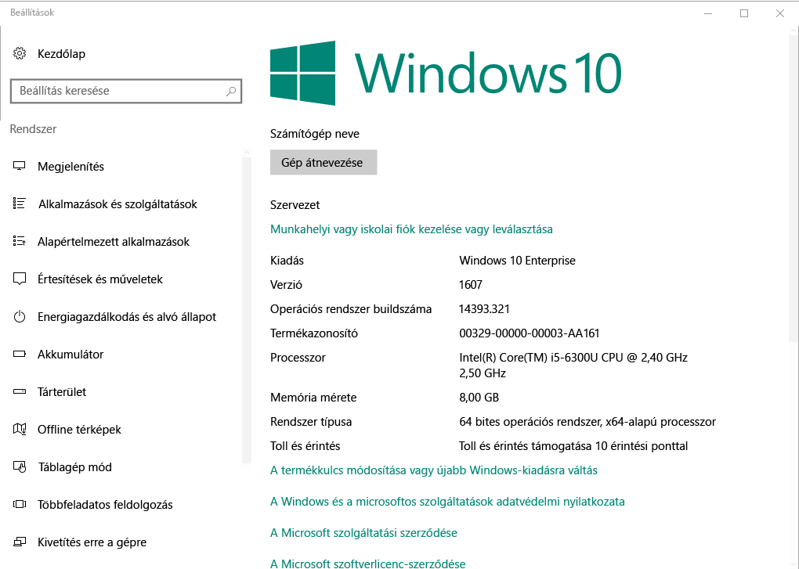

# Windows-eszközök regisztrálása az Intune vállalati portál  

Munkahelyi és iskolai alkalmazásokhoz, e-mailek és fájlok biztonságos eléréséhez az Intune vállalati portál alkalmazásban a Windows-eszköz regisztrálása. Ha a szervezet igényel, illetve javasolja az egyes alkalmazások, például Office vagy a onedrive vállalati verzió, vagy kap őket regisztráció során, vagy elérhetők legyenek a céges portál regisztrálása után.  

Windows 10-es eszközöket a vállalati portál webhelyen keresztül lehet regisztrálni *vagy* alkalmazást. Ha regisztrál egy eszközt a Windows korábbi verziójával, regisztrálnia kell az eszközt a céges portál webhelyen keresztül.  

## Telepítse a vállalati portál alkalmazás  
Előfordulhat, hogy már rendelkezik a vállalati portál alkalmazás telepítve van az eszközén. Ellenőrizze az alkalmazás a __minden alkalmazás__ listája.  Ha nem látja a céges portált az alkalmazáslistában, a következő lépésekkel telepítheti.  

1. Nyissa meg **Microsoft Store** az eszközön.

2. Az a **keresési** mezőbe írja be a **céges portál**.

3. Az eredménylistában válassza a **Céges portál** > **Telepítés** elemet.

4. Válassza a **Telepítés** vagy az **Ingyenes** lehetőséget. Nincs különbség a két lehetőség; között függ, hogy a szervezet hogyan állította be az alkalmazás megjelenik a szöveg.  

## Keresse meg a Windows 10-es verzió száma  
Regisztráció lépései a Windows 10-es eszközök különböző verziói esetében eltérőek. Az alábbi lépések bemutatják, hogyan találhatja meg a verziószámot a Windows 10 asztali és mobileszközöket. Ha már tudja, hogy a verzió, továbbra is a javasolt regisztrációs lépéseket.  

### Windows 10 rendszerű asztali eszközök  

1. Lépjen a **Start** menüre.

2. A keresősávba írja be "a gép névjegye." Válassza ki __a gép névjegye__ az eredmények közül.  

     

3. Görgessen le a **Windows-specifikációk** keresése a **verzió** Windows 10-van telepítve a számítógépen.  

     

4. Ha a verzió  

    *  __1607-es vagy újabb__: Úton-eszköz regisztrálása a [ **beállítások** > **fiók** > **hozzáférés munkahelyi vagy iskolai** útvonal](enroll-windows-10-device.md#enroll-windows-10-version-1607-and-later-device).   
    * __1511-es vagy korábbi__: Úton-eszköz regisztrálása a [ **beállítások** > **fiók** > **a fiókok** útvonal](enroll-windows-10-device.md#enroll-windows-10-version-1511-and-earlier-device).  

### Windows 10 Mobile rendszerű eszközök       

1.  Lépjen a __minden alkalmazás__ , és válassza ki a __beállítások__ alkalmazást.  
2.  Válassza a __Rendszer__ > __Névjegy__ lehetőséget.      
3.  A __eszközadatokat__, keresse meg a __verzió__.  
4. Ha a verzió  

    *  __1607-es vagy újabb__: Az eszköz segítségével regisztrálja a [ **beállítások** > **hozzáférés munkahelyi vagy iskolai** útvonal](enroll-windows-10-device.md#enroll-windows-10-version-1607-and-later-device).   
    * __1511-es vagy korábbi__: Az eszköz segítségével regisztrálja a [ **beállítások** > **fiókok** útvonal](enroll-windows-10-device.md#enroll-windows-10-version-1511-and-earlier-device).  

## Nem Windows 10-eszközök regisztrálása  
A céges portál webhelyen keresztül más támogatott Windows-eszközök regisztrálása használja a következő cikkeket:   
* [Windows 8.1. vagy Windows RT 8.1-eszköz](enroll-your-W81-or-rt81-windows.md)  
* [Windows Phone 8.1 rendszerű eszköz](enroll-your-wp81-windows.md)    

## További lépések  
Most, hogy megismerte a támogatott eszközök és a Windows 10-es verzió számát, folytassa az ajánlott regisztrációs cikk.  
 
Eszközök felügyeletével kapcsolatos további információkért a vállalati portálon, és hogyan egyaránt használhatók az iskolák és a munkahelyi, lásd a következő cikkeket:  
* [Felügyelt eszközök használata munkahelyi vagy iskolai erőforrások elérésére](use-managed-devices-to-get-work-done.md)  
* [Mi történik, ha regisztrálja eszközét az Intune-ban](what-happens-if-you-install-the-company-portal-app-and-enroll-your-device-in-intune-windows.md)  
* [Milyen információt szervezetem látható, ha regisztrálom az eszközömet?](what-info-can-your-company-see-when-you-enroll-your-device-in-intune.md)  

Segítség Forduljon a cég informatikai támogatásához. [Nyissa meg a céges portál webhelyet](https://go.microsoft.com/fwlink/?linkid=2010980) található a szervezet informatikai kapcsolattartási adatait.  
