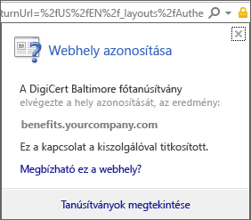

# Az androidos eszközhöz hiányzik egy, a cég informatikai támogató szolgálata által kért tanúsítvány

Ha az eszköz nincs regisztrálva az Intune-ban, és hiányzik róla egy, a cég informatikai támogatási szolgálata által kért tanúsítvány, nem fog tudni bejelentkezni a Céges portál alkalmazásba. Amikor megpróbál bejelentkezni, a következő üzenet jelenik meg:

A probléma megoldásához és a szükséges tanúsítvány beszerzéséhez hajtsa végre a következő két fő lépést:

- Azonosítsa a hiányzó tanúsítványt azáltal, hogy megtekinti egy vállalati vagy iskolai számítógépen.
- Használja az eszközt a hiányzó tanúsítvány letöltéséhez az internetről.

## Azonosítsa a hiányzó tanúsítványt azáltal, hogy megtekinti egy vállalati vagy iskolai számítógépen

1. Nyissa meg egy számítógépen az Internet Explorert. Ha nincs erre a célra használható számítógépe, forduljon a cég informatikai támogató szolgálatához. A cég informatikai támogató szolgálatának elérhetőségét a [Céges portál webhelyén](https://portal.manage.microsoft.com#HelpDeskDialog) találja.

2. Lépjen a [Céges portál webhelyére](https://portal.manage.microsoft.com#HelpDeskDialog), és jelentkezzen be a munkahelyi vagy iskolai fiókjával.

3. A böngésző címsorának jobb szélén válassza az alábbi képernyőképen látható, lakat alakú szimbólumot.

    

    Ha nem látja a lakat alakú szimbólumot, ne lépjen tovább, hanem forduljon a cég informatikai támogató szolgálatához. A lakat azt jelenti, hogy biztonságosan jelentkezett be, ezért ha nem látja a szimbólumot, nem javasolt a továbblépés.

4. Válassza a **Tanúsítványok megtekintése** elemet.

    

5. A **Tanúsítvány** párbeszédpanelen válassza a **Tanúsítványlánc** elemet, majd azonosítsa a tanúsítványt, amelyet le kell töltenie az internetről. A szükséges tanúsítvány neve ugyanazon a helyen lesz, mint az előbbi képernyőfelvételen kiemelt tanúsítványé.

## Töltse le és telepítse a hiányzó tanúsítványt Android-mobileszközére

1. Ha keresőmotort, például Binget vagy Google-t használ, keressen rá az előző szakaszban azonosított hiányzó tanúsítvány nevére. A tanúsítvány különböző „kiterjesztésekkel” rendelkezhet, például „.crt”, „.pem” stb.

2. Töltse le a főtanúsítványt a webhelyről.

3. Miután a tanúsítvány letöltése befejeződött, húzza le az értesítéseket fentről, és koppintson a tanúsítvány nevére az értesítések listájában.

4. Az alábbi képernyőképen látható **Name the Certificate** (A tanúsítvány elnevezése) párbeszédpanelben fogadja el az alapértelmezett tanúsítványnevet.

5. Győződjön meg arról, hogy **Credential Use** (Hitelesítő adatok használata) beállítás értéke **Used for VPN and apps** (VPN-hez és az alkalmazásokhoz használt), és koppintson az **OK** gombra.

    

6. Zárja be a Céges portál alkalmazást.

7. Nyissa ismét meg a Céges portál alkalmazást. Ekkor már be kell, hogy tudjon jelentkezni a Céges portál alkalmazásba. Ha segítségre van szüksége, lépjen kapcsolatba a cég informatikai támogató szolgálatával.

Ha ugyanazt a „Hiányzó tanúsítvány” üzenetet látja, mint amelyik fentebb is látható, és már követte a fenti lépéseket, akkor valószínűleg egy másik tanúsítvány is van, amelyet a cég informatikai támogató szolgálatának segítségével telepíteni kell. Kérje a cég informatikai támogató szolgálatának segítségét a [Céges portál webhelyen](https://portal.manage.microsoft.com#HelpDeskDialog) található elérhetőségeken.
